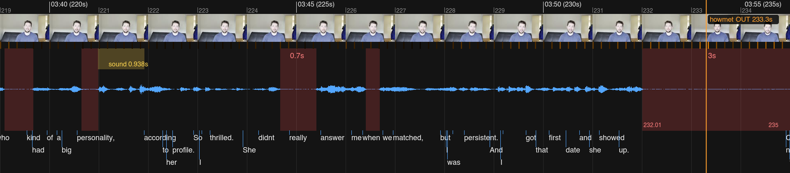
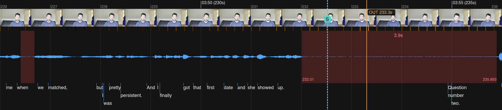

# Ripple

**The missing eyes and ears for agents that edit video.**

An editor cuts with eyes on the picture and ears on the waveform. A coding
agent has neither: it can't watch a take, can't hear a pause, and transcripts
arrive in eight-second blocks. Ripple is a plugin for Claude Code and Codex
that closes the gap — the **craft** of editing as skills, the **senses** as a
CLI that turns footage into artifacts a model reads natively, and **taste** as
memory that survives the session.

## Install

Claude Code:

```
/plugin marketplace add conmeara/ripple
/plugin install ripple@ripple
```

Codex:

```bash
codex plugin marketplace add conmeara/ripple
codex plugin add ripple@ripple
```

Start a new Codex task after installation so its skill catalog refreshes.

The bundled CLI requires Node.js 20 or newer. Both hosts require
`ffmpeg`/`ffprobe` on PATH (`brew install ffmpeg`). Optional but recommended
for word-accurate editing: `brew install whisper-cpp` plus a model in
`~/.ripple/models/` (the plugin walks you through it).

## What the agent sees



This is `ripple timeline-sheet`: the editor's timeline rendered as a single
image on a single time axis — frames, motion ticks, the waveform with every
silence measured, the word-aligned transcript, and the cut under
consideration. Durations are printed onto the image because a model reads
"3.9s" far more reliably than it measures pixels.

## Why agents miss cuts

Ripple is built from real agent editing sessions. The first cuts were close
but consistently mistimed, and the failure always had the same shape:

- **Transcripts are too coarse.** Subtitle-level timing arrives in ~8-second
  blocks; a cut lands on the end of a *word*.
- **Frame sheets can't hear.** A tiled sheet shows a face mid-sentence — not
  whether the speaker paused or finished.
- **Word timings lie at the edges.** Whisper stretches word ends across
  silence and smears resumed speech back into pauses — exactly the boundaries
  an edit lands on.

A human resolves this by looking and listening. Ripple resolves it with
measurement: silence detection at three thresholds fused with word timings,
pitch contour on the last word, breaths, motion energy — and a standing rule
that no cut is locked on a single signal.

## Craft, senses, taste

An editor is three things. Ripple gives the agent all three.

**Craft — the skills.** Playbooks for every phase of an edit: planning from a
perception index, the endpoint rule (`OUT = lastWordEnd + tail`, arithmetic,
never eyeballed), localized repair ("question 5 got cut off" → fix one scene,
not the whole timeline), HDR-safe finishing, deterministic QA. Steering
adjectives — "tighter", "punchier", "let it breathe" — are operationalized
protocols, not vibes. Motion graphics route to the official
[HyperFrames](https://github.com/heygen-com/hyperframes) and
[Remotion](https://www.remotion.dev/docs/ai/skills) skills.

**Senses and hands — the `ripple` CLI.** One command per loop agents otherwise
rebuild by hand. A cached per-source **perception index** (word timings fused
with silence, sentences with pace, fillers, laughs/claps, pitch, breaths,
motion, scene changes); **sheets** that put picture, sound, and text on one
time axis; **cut-point arithmetic** with categorical red flags; an editor's
**workbench** (output↔source timecode mapping, manifest history and diffs,
phrase search across sources, multicam sync, word-accurate captions); and a
manifest-driven **renderer** — title cards, J/L-cuts, dissolves, music beds,
per-scene gain, reframe presets, HDR-safe assembly.

**Taste — the memory.** `VIDEO.md` holds the project's standing creative
direction (register, color policy, pacing, brand); `edit.json` holds each
video's cut decisions *with reasoning*. User steering writes back, so lessons
persist across sessions — and travel into Premiere/Resolve as timeline markers
on handoff.

## One cut, end to end

```
ripple analyze interview.mov      # index once: words, silences, sentences, pitch, motion
ripple candidates interview.mov --start 209 --end 233.3
```

`candidates` answers with arithmetic, not vibes:

```jsonc
{
  "timing": {
    "lastWordEnd": 231.92,
    "tailGap": 1.38,
    "nextText": "Question number two.",
    "nextAudioStart": 235.893,
    "terminalPitch": "level"
  },
  "flags": [
    { "flag": "DEAD_AIR_TAIL",
      "detail": "1.38s of nothing after the last word (bound 1s) — cut at lastWordEnd + tail preference" }
  ],
  "suggestedOut": 232.52
}
```

And shows its work on the cut-card sheet:



The proposed OUT (orange, 233.3) sits inside 3.9 seconds of dead air, one
second before the interviewer's "Question number two" leaks in. `S` is the
suggested OUT — 232.52, last word end plus the project's tail preference.
Move the cut, clear the flag, then:

```
ripple cut edit.json                        # clips, cards, J/L-cuts, dissolves, music, assembly
ripple qa outputs/final.mp4 --manifest edit.json   # gates: tail silence, loudness, leaked takes
```

Any flag blocks locking a range until resolved or overridden with a written
reason.

## Commands

Ask in plain language ("cut a 30-second promo from these clips, synced to the
track") or invoke a phase directly: `/ripple <phase>` in Claude Code, or
`$ripple <phase>` in Codex.

| Command | What it does |
|---|---|
| `/ripple init` | Interview → `VIDEO.md` (the project's taste memory) |
| `/ripple develop` | Pre-production: script, AV script, shot list, storyboards |
| `/ripple plan` | Probe + analyze sources (perception index) → first `edit.json` |
| `/ripple generate` | Create missing elements: VO (ElevenLabs), music, stills/b-roll (Gemini/Veo) |
| `/ripple select` | Pick the best takes, with recorded reasoning |
| `/ripple edit` | Execute the cut with verified endpoints |
| `/ripple grade` | Compare color grades on stills; record the pick |
| `/ripple finish` | Color-safe assembly and delivery QA |
| `/ripple repair` | "Question 5 got cut off" → localized fix |
| `/ripple review` | HTML review page + independent QA pass |
| `/ripple handoff` | Rough cut → Premiere/Resolve timeline (OTIO, FCP7 XML, EDL) with reasoning as markers |

Underneath, the `ripple` CLI (run `ripple help`, or `<command> --help`):

| | Commands |
|---|---|
| **Perceive** | `analyze` · `timeline-sheet` · `frame-sheet` · `candidates` · `transcribe` · `probe` · `sources` · `search` · `beats` · `sync` |
| **Decide** | `select` · `locate` · `snapshot` · `compare` |
| **Render** | `cut` · `captions` · `grade` |
| **Verify** | `qa` · `review` · `doctor` |
| **Ship** | `handoff` |

## CLI conventions

`ripple` follows [clig.dev](https://clig.dev/) with two deliberate deviations,
chosen because the primary user is an agent: **errors go to stdout as JSON
envelopes** (`{ok:false, error:{…}}`) so consumers parse one stream with one
shape, and state lives in **`~/.ripple/`** rather than XDG paths. Exit codes:
0 success, 1 failed gate or runtime failure, 2 invalid usage or missing tool.
`--version` and per-command `--help` behave as expected.

## Principles

Everything is a file: transcripts, the perception index, the edit manifest,
QA snapshots. Renders are derived artifacts. The agent looks at its work
(timeline sheets before locking cuts, frame sheets after every render),
places endpoints by arithmetic, never trusts a single signal for a cut point,
and never silently converts color.

## Status

Early, and built the honest way: every capability exists because a real agent
editing session needed it. The
[Ripple app](https://github.com/conmeara/ripple-app) is the experimental
desktop bench this plugin distills.

## License

Apache-2.0
