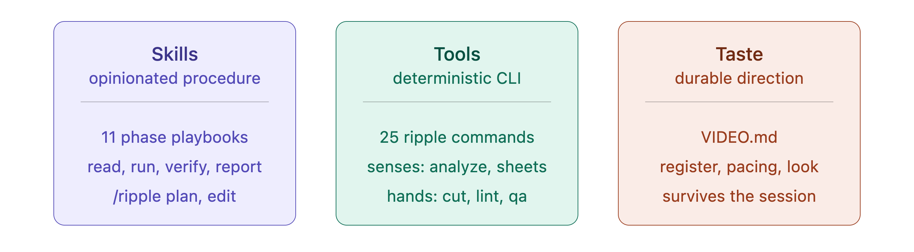

# Ripple

**Give agents skills, tools, and taste for video editing.**

Ripple is a video-editing plugin for Claude Code and Codex. It translates
footage and timelines into time-aligned images, structured text, and explicit
edit decisions, then gives the agent tools and opinionated playbooks to change
the cut and an independent QA subagent to verify the result.

## What's included



### Tools

Models experience video as text and image tokens, not as a continuous
timeline. A frame sheet can show the picture, but not whether a speaker has
finished, how long a silence lasts, where a breath lands, or whether the next
take has started leaking into the cut. Editing depends on the relationships
between those signals over time.

The Ripple CLI gives the agent the senses and hands of an editor. `ripple
analyze` builds a cached perception index for each source: word timings fused
with measured silence, sentence boundaries and pace, fillers, audible
non-speech events, terminal pitch, breaths, motion, scene changes, and energy.

#### Two channels for the timeline

##### Image channel

`timeline-sheet`, `frame-sheet`, and cut cards combine frames, motion,
waveform, silence, non-speech events, transcript, and edit markers into images
the model can inspect directly.


##### Text channel

`describe` renders the same perception index as structured JSON: sources,
sentences, words, silences, pace, pitch, breaths, scene changes, cut-point
flags, and exact timestamps.

```bash
ripple describe interview.mov
```

An abridged response looks like:

```jsonc
{
  "mode": "overview",
  "duration": 30,
  "speech": {
    "seconds": 10.8,
    "ratio": 0.36,
    "silenceSeconds": 19.2
  },
  "sentences": [
    {
      "start": 0.5,
      "end": 2.8,
      "duration": 2.3,
      "text": "We met at the coffee shop.",
      "wps": 2.609,
      "terminalPitch": "falling",
      "gapAfter": 2.2
    }
  ],
  "silences": [
    { "start": 2.8, "end": 5.0, "duration": 2.2 }
  ],
  "nonSpeech": [
    { "start": 9.0, "end": 10.2, "duration": 1.2 }
  ]
}
```

Both channels come from the same perception index and use the same source
timecodes. The agent can reason in tokens, confirm the situation visually, and
make an edit without guessing how one view maps to the other.

#### The rest of the workbench

The CLI also handles source inspection, transcription, timeline navigation,
phrase search, take selection, multicam sync, cut history and comparison,
captions, grading, rendering, deterministic QA, and NLE handoff. Commands
return structured JSON and write inspectable artifacts, so decisions remain
traceable and renders remain reproducible.

Run `ripple help` or `ripple <command> --help` for details.

| | Commands |
|---|---|
| **Perceive** | `analyze` · `timeline-sheet` · `describe` · `frame-sheet` · `candidates` · `transcribe` · `probe` · `sources` · `search` · `beats` · `sync` |
| **Decide** | `status` · `select` · `locate` · `snapshot` · `compare` |
| **Render** | `cut` · `captions` · `grade` |
| **Verify** | `lint` · `qa` · `review` · `doctor` |
| **Taste** | `study` |
| **Ship** | `handoff` |

All commands print JSON to stdout, including error envelopes. Exit codes are
`0` for success, `1` for a failed gate or runtime failure, and `2` for invalid
usage or a missing dependency. State lives in `~/.ripple/`.

### Skills

One Ripple skill routes to 11 editing playbooks covering development,
planning, generation, take selection, editing, grading, finishing, repair,
review, and NLE handoff. It also turns directions such as `/ripple tighter`,
`punchier`, `breathe`, and `quieter` into defined inspect, change, render, and
verify loops.

Ask in plain language or invoke a phase directly with `/ripple <phase>` in
Claude Code and `$ripple <phase>` in Codex.

| Command | What it does |
|---|---|
| `init` | Capture the project's taste and write `VIDEO.md` |
| `develop` | Create a script, AV script, shot list, or storyboard |
| `plan` | Inspect sources and draft the first `edit.json` |
| `generate` | Create missing voice-over, music, stills, or b-roll |
| `select` | Compare takes and record why the best ones were chosen |
| `edit` | Execute and iterate the cut with verified endpoints |
| `grade` | Compare color variants and record the choice |
| `finish` | Assemble safely and run delivery QA |
| `repair` | Fix a flagged scene without rebuilding the edit |
| `review` | Generate a review page and run an independent QA pass |
| `handoff` | Export OTIO, FCP7 XML, or EDL for Premiere or Resolve |

#### Opinionated defaults

The playbooks are concrete: inspect the timeline before locking a cut,
calculate endpoints instead of eyeballing them, use multiple signals, repair
one scene instead of rebuilding the edit, and never silently convert color.

They also choose a production stack:

| Need | Default |
|---|---|
| Cut, trim, or assemble existing footage | FFmpeg through the Ripple CLI; no framework |
| Motion graphics from scratch | Official [HyperFrames](https://github.com/heygen-com/hyperframes) skills |
| Timed overlays, React components, or design handoff | Official [Remotion](https://www.remotion.dev/docs/ai/skills) skills, timed from the word-level transcript |
| Voice-over | [ElevenLabs](https://github.com/elevenlabs/skills) TTS: `eleven_multilingual_v2` by default, `eleven_v3` for a more expressive read |
| Music bed and sound effects | ElevenLabs Music and SFX; instrumental beds generated to the manifest's exact duration |
| Stills, cards, and storyboards | Gemini Image (“Nano Banana”); Flash by default, Pro for complex composition |
| B-roll | Recut existing footage first, then Pexels/Pixabay stock; use Veo only for a storyboarded gap shot |
| Scratch or offline voice-over | Piper TTS, then swap the final voice and re-check the endpoints |
| Alternative image generation | Imagen when Gemini misses on photorealism; OpenAI only when the project already uses OpenAI; fal.ai when one key needs to cover broader models |
| Alternative video generation | fal.ai before a direct Kling integration for ordinary Kling shots; Kling directly for avatar or lip-sync work; Runway when one hero shot matters more than cost |
| Specialized formats | HeyGen for avatar-led video; Suno only when the project needs a song rather than a music bed |

#### Independent QA

After every render or repair, Ripple hands the output to a bundled, read-only
[`qa-reviewer`](agents/qa-reviewer.md) subagent. The editor does not get to be
the only judge of its own work.

The reviewer receives a narrow checklist of the failure modes that matter for
that change—such as a complete sentence ending, no leaked prompt audio,
unchanged neighboring scenes, preserved color metadata, and a clean decode.
It gathers direct evidence with the Ripple CLI, transcripts, timeline sheets,
and media probes, then reports `PASS` or `FAIL` for each item. It cannot edit
or re-render the video.

Deterministic QA catches known technical failures; the fresh context checks
the specific editorial promise the editing agent just made. When the host
cannot run subagents, Ripple applies the same checklist in the current context
and discloses that the review was not independent.

### Taste

[`VIDEO.md`](skills/ripple/templates/VIDEO.md) stores the project's standing
creative direction: pacing, register, color policy, brand, anti-references,
and confirmed steering. [`edit.json`](schemas/edit.schema.json) stores the
decisions for the current cut. Direction becomes project state instead of a
prompt that must be reconstructed every session.

`ripple study` can measure a reference edit's rhythm, delivery pace, tail
preference, silence usage, energy, and grade lean, then propose matching
`VIDEO.md` values with the evidence behind them. Ripple never changes the
project's taste without user approval.

## Quick start

Claude Code:

```text
/plugin marketplace add conmeara/ripple
/plugin install ripple@ripple
```

Codex:

```bash
codex plugin marketplace add conmeara/ripple
codex plugin add ripple@ripple
```

Run `/ripple init` in Claude Code or `$ripple init` in Codex—or simply describe
the edit:

```text
Cut a 30-second promo from these clips, synced to the track.
```

Requires Node.js 20+ and `ffmpeg`/`ffprobe` on `PATH` (`brew install ffmpeg`).
For word-accurate editing, install `whisper-cpp` and place a model in
`~/.ripple/models/`. The plugin guides you through setup.

For the standalone CLI without the agent skill:

```bash
npm install --global ripple-video
```

The npm package installs the `ripple` command. Use the plugin installation
above when you also want the Claude Code or Codex skill and its playbooks.

## License

Apache-2.0
