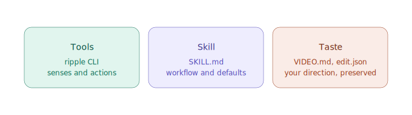
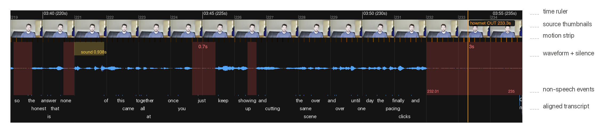
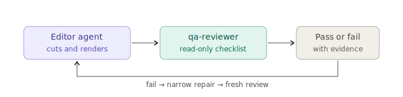

# Ripple

**Give agents the skills, tools, and taste to make video with you.**

Ripple is an open-source video-making toolkit for coding agents. It helps an
agent make video with you—not just edit footage—whether you start with a brief,
existing footage, or both.

Agents cannot watch or hear a timeline directly. Ripple turns video into
evidence they can reason over: word-aligned transcripts, frames, motion,
waveform, silence, measured timing, and explicit cut decisions on one shared
time axis.

The CLI supplies the senses and actions, the skill supplies strong editorial
and production opinions, `VIDEO.md` preserves your taste, and `edit.json` keeps
the current cut inspectable. Together, they carry the agent from perception and
decision through assembly, verification, and delivery.

> **Start here:** [Install Ripple](#install), then tell your agent: `Make a
> 30-second promo from these clips and verify every cut.`

## What's included



| Layer | Included | Role |
|---|---|---|
| **Tools** | The [`ripple`](#tools-ripple-cli) CLI | Understand media, inspect timelines, make edits, and export results |
| **Skill** | An [opinionated video-making guide](skills/ripple/SKILL.md) | Strong defaults for planning, editing craft, and choosing production tools and services |
| **Taste** | [`VIDEO.md`](skills/ripple/templates/VIDEO.md) and [`edit.json`](schemas/edit.schema.json) | Preserve user direction and every decision in the current cut |

## Tools: Ripple CLI

The CLI is a local Node.js application. Ripple provides the analysis, timeline,
editing, and QA logic; it uses FFmpeg and ffprobe for media processing, plus
whisper-cpp for transcription when needed. Every command prints structured
JSON; run `ripple help` or `ripple <command> --help` for usage.

At the center is the timeline sheet: frames, motion, waveform, silence, words,
and the proposed cut on one shared axis.



For rendering, the gate is explicit: `edit.json` → `ripple lint` →
`ripple cut` → `ripple qa`.

| Command | What it does |
|---|---|
| `analyze` | Build a cached index of words, silence, pace, sound events, scenes, motion, and energy |
| `candidates` | Check proposed IN/OUT points with transcripts, silence, frames, and cut-safety flags |
| `frame-sheet` | Render tiled frames, including scene-change sampling, for visual inspection |
| `timeline-sheet` | Align frames, motion, waveform, silence, words, and cut markers in one image |
| `lint` | Check `edit.json` before rendering against cached transcript and timing evidence |
| `cut` | Render clips and the full assembly, including cards, J/L cuts, dissolves, and music |
| `qa` | Inspect the rendered file, save QA evidence, and optionally render an HTML report |
| `search` | Find spoken phrases across indexed sources |
| `select` | Group similar takes and recommend the strongest in each group |
| `sync` | Measure multicam offsets with audio cross-correlation |
| `beats` | Detect BPM and a beat grid for music |
| `study` | Measure a reference edit and propose matching `VIDEO.md` values |
| `doctor` | Check FFmpeg, whisper, encoders, and optional tools, then print fixes |
| `probe` | Inspect media streams and HDR, or inventory the project media bin |
| `history` | Save, list, and diff edit snapshots |
| `captions` | Create output-time SRT and ASS captions, with optional burn-in |
| `handoff` | Export OTIO, Premiere XML, FCPXML, or EDL timelines for an NLE |
| `transcribe` | Reuse subtitles or transcribe locally, with optional word timing |

```bash
ripple analyze interview.mov
ripple timeline-sheet interview.mov
```

## Hook

After `edit.json` changes, Ripple's fail-open hook surfaces cached cut-safety
findings without blocking the write. Claude Code loads it with the plugin. In
the first Codex session, **Hooks need review** appears: choose **Review hooks**,
inspect Ripple's command, then trust it. Codex runs only trusted unmanaged
hooks. The agent still runs `ripple lint` before rendering.

## Skill

The full [`ripple` skill](skills/ripple/SKILL.md) is an opinionated guide to
making video with an agent. It encodes strong defaults for planning, editing,
finishing, and choosing specialist services for generated video, voice, music,
images, and motion graphics. Use only the phases the job needs.

| Phase | What the agent does with you |
|---|---|
| **Taste** | Capture standing creative direction in `VIDEO.md` |
| **Develop** | Agree on a script, AV script, or shot list before production |
| **Produce** | Choose specialist generation tools and preserve provenance |
| **Edit** | Analyze sources, inspect evidence, place cuts, and repair locally |
| **Finish** | Verify, grade, caption, reframe, render, or hand off to an NLE |

Generation is routed to the right specialist tool; it is not hard-wired into
the CLI. Ripple keeps ownership of timing, assembly, and verification.

## Taste

Taste comes from the user, not the model. `VIDEO.md` stores the project's
standing direction: pacing, format, color, brand, references, and
anti-references. `edit.json` is the machine-checkable paper edit for the current
video: sources, bounds, reasoning, transitions, and delivery settings.

`ripple study` can measure a reference edit and propose values. Nothing becomes
standing direction until the user approves it.

## QA loop

After every render or repair, Ripple gives a read-only
[`qa-reviewer`](agents/qa-reviewer.md) subagent a narrow checklist for what
changed. It returns `PASS`, `FAIL`, or `NOT VERIFIED` with direct evidence and
cannot edit or re-render the video.



A separate agent brings fresh context, so the editor is not the only judge of
its own work.

## Install

### Plugin (recommended)

The plugin installs the skill and its bundled CLI.

Claude Code:

```text
/plugin marketplace add conmeara/ripple
/plugin install ripple@ripple
```

Codex:

```bash
codex plugin marketplace add conmeara/ripple
codex plugin add ripple@ripple
```

### Standalone CLI

> The plugin installs the current repository version. The standalone CLI
> installs the latest published npm release.

```bash
npm install --global ripple-video
ripple doctor
```

Requirements: Node.js 20+, `ffmpeg`, and `ffprobe`. Add whisper-cpp and a model
for word-accurate editing; existing subtitles work without it. ImageMagick adds
fully labeled timeline sheets, and `yt-dlp` enables `study` with URLs. Optional
production providers may require their own credentials, but the core CLI does
not.

## Comparison

Ripple combines the full local-first loop in one toolkit.

| Capability | Ripple | [video-use](https://github.com/browser-use/video-use) | [OpenMontage](https://github.com/calesthio/OpenMontage) | [auto-editor](https://github.com/WyattBlue/auto-editor) |
|---|:---:|:---:|:---:|:---:|
| Make from a brief or edit footage | ● | ◐ | ● | ○ |
| Local transcript + visual analysis | ● | ◐ | ● | ◐ |
| No cloud service required for core editing | ● | ○ | ● | ● |
| Agent-readable timeline | ● | ● | ◐ | ○ |
| Verified cut endpoints | ● | ◐ | ○ | ○ |
| Persistent creative direction | ● | ◐ | ● | ○ |
| Independent read-only QA reviewer | ● | ○ | ○ | ○ |
| NLE timeline export | ● | ○ | ○ | ● |

**● Included · ◐ Partial or different · ○ Not included or not documented**

## Contributing

[Issues](https://github.com/conmeara/ripple/issues) and pull requests are
welcome. Run `npm test` before submitting a change.

## License

[Apache-2.0](LICENSE)
