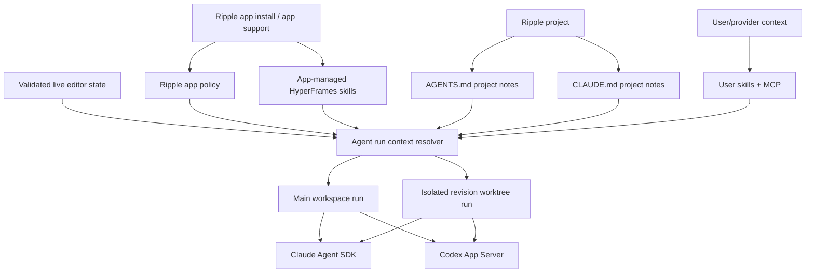
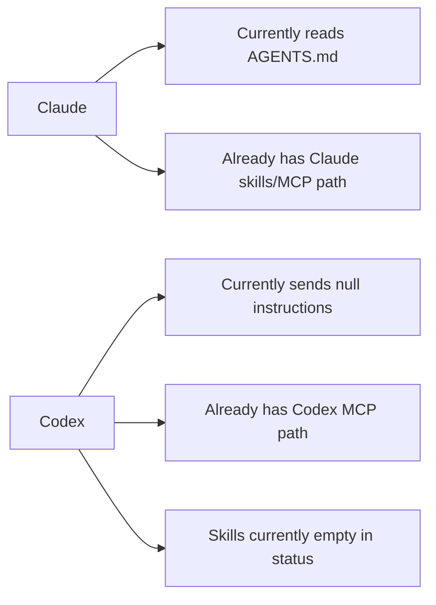

# Phase 13: Agent Run Context, Skills, And MCP Setup

This ExecPlan must be maintained according to `PLANS.md`.

## Purpose / Big Picture

After this phase, every Ripple project is ready for both supported agent
providers without asking the user to understand prompt engineering, skill
installation, MCP setup, or HyperFrames authoring rules.

The target architecture is layered. Ripple app policy is app-owned and delivered
through provider instruction channels: Codex App Server `developerInstructions`
and Claude Agent SDK `systemPrompt.append` with the `claude_code` preset. This
is where non-negotiable product behavior lives: HyperFrames-first editing,
motion-editor language, project/revision boundaries, no silent edits to Main,
main-process path validation, and accept/reject review semantics.

`AGENTS.md` and `CLAUDE.md` still exist, but they are narrow user-editable
project notes. New Ripple projects should get short files that hold
project-specific preferences, brand rules, commands, and conventions. Existing
projects should not be mutated just because they are opened; Ripple should check
their readiness and offer explicit backfill or refresh actions.

HyperFrames skills are bundled and managed by Ripple by default, not copied into
every project as the source of truth. The app should ship or unpack one
canonical HyperFrames skill bundle and expose it to every project and isolated
revision worktree through provider-native mechanisms: Codex App Server
`skills/list` with `perCwdExtraUserRoots`, and Claude SDK local plugins or an
app-controlled filesystem skill root. Project `.agents/skills` and
`.claude/skills` are optional portability/user customization targets, not the
normal app-owned distribution path.

Ripple also makes the user's existing agent environment available instead of
replacing it. Claude and Codex runs should be able to use enabled user/project
skills and MCP servers when the user opts into that provider-native context.
External MCP remains user/provider-controlled. Live editor state such as active
composition, frame, comment anchor, revision workspace, preview source, and
export target is derived by the main process per run and is never written into
static project instruction files.

The visible result is simple: a designer can ask Claude or Codex to create or
edit a title card, lower third, transition, social overlay, or frame-comment
revision, and Ripple quietly starts the provider run with app-level Ripple
instructions, provider-native skills made visible, project notes discoverable,
and the current composition/frame/comment/revision passed as live context.
Claude and Codex still use their native skill-loading behavior to decide which
skills to invoke at runtime. Internally, this per-run assembly point is an agent
run context resolver, not a large policy framework or custom skill loader.

## Progress

- [x] 2026-05-02 / User + Codex: Agreed to use native provider instruction
  files rather than creating a Ripple-owned skill bundle. `AGENTS.md` is the
  Codex-facing file; `CLAUDE.md` is the Claude-facing file.
- [x] 2026-05-02 / User + Codex: Agreed that Ripple should enable existing user
  skills/MCP and install or register HyperFrames skills so users' agents can
  access them while working in Ripple.
- [x] 2026-05-02 / Codex: Read `PLANS.md`, the Phase 13 roadmap section, Phase
  9 provider-integration plan, Phase 12 template plan, current project scaffold,
  Claude capability loading, Codex MCP loading, skill router, and provider
  prompt paths before drafting this plan.
- [x] 2026-05-02 / Codex + sub-agents: Audited the draft against local Ripple
  architecture, the local bundled Codex App Server schema, the local Claude
  Agent SDK package, the installed HyperFrames package, and official Codex,
  Claude, and HyperFrames docs.
- [x] 2026-05-03 / User + Oracle + Codex + sub-agents: Revised the target
  architecture. `AGENTS.md` and `CLAUDE.md` are no longer the primary app system
  prompt; they are short user-editable project notes. Ripple app policy moves
  to provider instruction channels, HyperFrames skills become app-managed shared
  resources, existing projects are check-only on open, and worktrees receive
  deterministic policy/skill access per run.
- [x] 2026-05-03 / User + Oracle + Codex: Confirmed the revised direction with a
  second Oracle review. Proceed after adjustment: rename the central layer to
  `agent-run-context-resolver`, keep it small, split project notes, runtime
  editor context, skill roots, and provider policy into focused helpers, and use
  motion-designer product language for explicit setup actions.
- [x] 2026-05-03 / User + Codex: Clarified that Ripple should lean on Claude and
  Codex native skill systems. Ripple makes app-managed HyperFrames skill roots
  available to providers and passes live editor state; it does not choose skills
  for the model or inject full skill bodies into prompts.
- [x] Milestone 0: Inventory current provider instruction, skills, and MCP
  behavior with tests or small probes.
- [x] Milestone 1: Add shared project instruction templates for `AGENTS.md` and
  `CLAUDE.md`.
- [x] Milestone 2: Scaffold and backfill instruction files for new and existing
  Ripple projects.
- [x] Milestone 3: Make Claude load `CLAUDE.md` and keep Claude skills/MCP
  available during agent-runtime sessions.
- [x] Milestone 4: Make Codex load `AGENTS.md` and wire the missing Codex skill
  visibility path without regressing Codex MCP.
- [x] Milestone 5: Add HyperFrames skill install/register flow.
- [x] Milestone 6: Add shared runtime context packaging for project,
  composition, comment, revision, preview, and export state.
- [x] Milestone 7: Validate provider paths with automated tests, schema probes,
  build, package, and bundled-resource checks.
- [ ] Milestone 8: Complete full live desktop/provider QA. The Electron dev app
  was launched, but Computer Use could not attach to the app window, so live
  GUI provider/chat/comment smoke remains a follow-up manual pass.
- [ ] Milestone 9: Add an agent run context resolver that separates app policy,
  project notes, app skill roots, user/provider-native context, and per-run
  runtime context for both Main and isolated revision workspaces.
- [ ] Milestone 10: Demote generated `AGENTS.md` and `CLAUDE.md`, stop mutating
  existing projects on open, and add explicit backfill/refresh/install actions.
- [ ] Milestone 11: Move canonical HyperFrames skills out of project roots into
  an app-managed bundle, while preserving optional project skill installation
  for portability.
- [ ] Milestone 12: Update Codex and Claude adapters to use provider-native app
  policy, deterministic app skill loading, correct resume/handshake behavior,
  and explicit tool/skill permissions.
- [ ] Milestone 13: Harden settings, path validation, revision-worktree
  reporting, and the full QA/test matrix for the revised architecture.

## Surprises & Discoveries

- Observation: The first Phase 13 implementation over-promoted project files
  and project-copied skills into app infrastructure.
  Evidence: `openExistingRippleProject()` calls the helpers that create
  `AGENTS.md`, `CLAUDE.md`, `.claude/skills`, and `.agents/skills`, so simply
  opening an existing project can mutate user files.

- Observation: Comparable tools use layered scopes instead of copying one full
  capability bundle into every project.
  Evidence: Cursor rules, Windsurf rules/skills, Continue rules/configs, and
  Claude memory/skills all separate app or organization defaults, project
  rules, user rules, memories, and skills/tools. Durable project files are for
  project-specific guidance; reusable skills are usually app/plugin/system/user
  scoped and loaded on demand.

- Observation: Codex's official surfaces support an app-managed HyperFrames
  skill root without per-project copies.
  Evidence: Codex App Server `skills/list` supports scoped `cwds`,
  `forceReload`, and `perCwdExtraUserRoots`, and typed `{ type: "skill", name,
  path }` input items can explicitly invoke resolved skills.

- Observation: Claude's official surfaces favor `systemPrompt.append` and local
  plugins for an app like Ripple.
  Evidence: Claude Agent SDK can preserve the `claude_code` preset while
  appending SDK-specific instructions, `settingSources` controls native
  project/user context loading, and local plugins can bundle skills. If
  `allowedTools` is used, `Skill` must be included for skill invocation.

- Observation: Revision worktrees cannot rely on project files or project
  copied skills alone.
  Evidence: The provider execution `cwd` may be an isolated generated-change
  workspace that does not contain newly backfilled policy files or skills, even
  when the canonical project root does. Capability status must report what the
  run can actually load from the execution workspace or deterministic fallback.

- Observation: The central layer should be named around one run's context, not
  "policy."
  Evidence: Oracle's second review found that "policy" is only one part of the
  layer. The same per-run decision also covers project notes, skill roots, MCP
  availability, permissions, native discovery, fallback status, and validated
  editor context. Comparable apps generally name these surfaces context, rules,
  skills, tools, and custom instructions rather than policy.

- Observation: Claude currently loads `AGENTS.md`, not `CLAUDE.md`, in the
  main agent-runtime path.
  Evidence: `src/main/lib/agent-runtime/providers/claude-runtime-capabilities.ts`
  reads `path.join(cwd, "AGENTS.md")` and appends it to the Claude Code preset
  system prompt.

- Observation: Codex currently resolves and reports MCP context, but its App
  Server `thread/start` call sends `baseInstructions: null` and
  `developerInstructions: null`.
  Evidence: `src/main/lib/agent-runtime/providers/codex-app-server-adapter.ts`
  calls `resolveCodexMcpSnapshot(...)`, emits MCP capability status, then starts
  the thread with null instruction fields.

- Observation: Skill mentions in the runtime prompt do not load skill files.
  They only become plain instruction text.
  Evidence: `src/main/lib/agent-runtime/prompt-mentions.ts` converts
  `@[skill:name]` to `Use the "name" skill(s) for this task.`

- Observation: Ripple's settings/mention skills surface currently scans Claude
  and plugin skill locations, not Codex skill locations.
  Evidence: `src/main/lib/trpc/routers/skills.ts` lists project
  `.claude/skills`, user `~/.claude/skills`, and enabled plugin skills.

- Observation: The official HyperFrames CLI exposes a skills installer for AI
  coding tools, but `hyperframes skills` is an installer, not a discovery
  command, and it fetches from the network.
  Evidence: `node_modules/.bin/hyperframes --help` includes `skills`, and the
  local CLI implementation shells out to `npx skills add heygen-com/hyperframes
  --all`.

- Observation: The locally installed HyperFrames package includes the minimum
  official skills Ripple needs, but not the full remote skill bundle.
  Evidence: `node_modules/hyperframes/dist/skills/` contains `hyperframes`,
  `hyperframes-cli`, and `gsap` skill directories with `SKILL.md` files and
  supporting references/scripts.

- Observation: Local HyperFrames guidance has one rule conflict that Phase 13
  must resolve before copying instructions into `AGENTS.md` or `CLAUDE.md`.
  Evidence: `node_modules/hyperframes/dist/skills/hyperframes/SKILL.md` implies
  composition duration can come from `data-duration`, while
  `node_modules/@hyperframes/core/docs/core.md` says composition clip duration
  comes from the registered GSAP timeline and does not require
  `data-duration` on the composition clip.

- Observation: The Codex App Server schema in the bundled `codex-cli 0.125.0`
  has the native surfaces Phase 13 needs.
  Evidence: `codex app-server generate-ts` produced `ThreadStartParams` with
  `baseInstructions` and `developerInstructions`, `UserInput` with
  `{ type: "skill", name, path }`, and client requests for `skills/list` and
  `skills/config/write`.

- Observation: Official Codex skill docs and the HyperFrames CLI docs disagree
  about the Codex user skill directory name.
  Evidence: Codex docs describe repo `.agents/skills` and user
  `$HOME/.agents/skills`, while HyperFrames CLI docs say `hyperframes skills
  --codex` installs to `~/.codex/skills/`. Phase 13 must use App Server
  `skills/list` and local probes as source of truth instead of hardcoding one
  assumption.

- Observation: Provider runs need both the isolated execution workspace and the
  canonical Ripple project root.
  Evidence: `AgentRuntimeService` resolves workspace context that includes the
  real project path, but provider adapters currently receive only
  `context.workspace.path` as `cwd`. Generated-change runs execute in isolated
  revision worktrees, so project-scoped instruction files, skills, and MCP can
  disappear unless the project root is carried through.

- Observation: Runtime live context needs an API shape before it can be
  reliably injected.
  Evidence: `AgentRuntimeChatTransport` and the `agentRuntime.chat` tRPC schema
  currently send prompt, provider, model, target conversation, attachments, and
  auth only. Selected composition, frame/time, preview source, revision view,
  and export source are owned by the Ripple shell and are not part of the
  runtime request payload yet.

- Observation: The bundled Codex App Server schema in this checkout supports
  the native instruction and skill primitives needed for Phase 13.
  Evidence: `resources/bin/darwin-arm64/codex app-server generate-ts --out
  /private/tmp/ripple-codex-schema` produced `ThreadStartParams` with
  `baseInstructions`, `UserInput` with `{ type: "skill", name, path }`, and
  `SkillsListParams` with `cwds`, `forceReload`, and
  `perCwdExtraUserRoots`.

- Observation: The packaged app includes the local HyperFrames skills copied
  from the installed package.
  Evidence: `find
  release/mac-arm64/1Code.app/Contents/Resources/app.asar.unpacked/node_modules/hyperframes/dist/skills
  -maxdepth 2 -name SKILL.md -print` found `hyperframes`,
  `hyperframes-cli`, and `gsap`.

- Observation: Live desktop QA is not fully complete from this run.
  Evidence: `bun run dev` launched the Electron app on the development
  `Agents Dev` user-data profile, initialized the database, opened the
  renderer, and reported `Motion runtime check: ready`; however Computer Use
  returned `NSOSStatusErrorDomain Code=-609 "connectionInvalid"` for both
  `1Code` and `com.github.Electron`, so the GUI smoke could not proceed. The
  same dev run showed real local provider readiness warnings for missing or
  unavailable MCP/Codex resources, so live provider execution should still be
  verified manually with the user's configured environment.

## Decision Log

- Decision: Ripple app policy belongs in provider instruction channels, not in
  per-project files.
  Rationale: App-owned behavior such as HyperFrames-first editing, revision
  isolation, no silent Main edits, provider boundaries, and motion-editor
  language must be deterministic across new projects, existing projects, and
  revision worktrees. Codex should receive this through
  `developerInstructions`; Claude should receive it through
  `systemPrompt: { type: "preset", preset: "claude_code", append: ... }`.
  Date/Author: 2026-05-03 / User + Oracle + Codex + sub-agents.

- Decision: `AGENTS.md` and `CLAUDE.md` are user-editable project notes, not
  Ripple's primary durable system prompt.
  Rationale: Provider docs and comparable tools treat these files as project
  guidance. Keeping them short avoids duplicate/conflicting instructions,
  respects existing user repos, and lets project teams own project-specific
  style, brand, commands, and conventions.
  Date/Author: 2026-05-03 / User + Oracle + Codex + sub-agents.

- Decision: HyperFrames skills are bundled once at the Ripple app level and
  exposed to every project/run through provider-native skill loading.
  Rationale: Copying bundled app skills into every project creates stale copies,
  dirty repos, confusing ownership, and unreliable revision-worktree behavior.
  Codex can use app-managed roots via `perCwdExtraUserRoots`; Claude should use
  a local plugin or app-controlled skill root. Project-local skills remain an
  explicit portability/customization option.
  Date/Author: 2026-05-03 / User + Oracle + Codex + sub-agents.

- Decision: Existing projects are check-only on open.
  Rationale: Opening a folder should not create untracked files or commit app
  artifacts into older/user-managed projects. Backfill, refresh, and project
  skill installation are explicit user actions with status reporting.
  Date/Author: 2026-05-03 / User + Oracle + Codex + sub-agents.

- Decision: Add a run-level `agent-run-context-resolver`, not a broad policy
  framework.
  Rationale: Provider adapters need one deterministic place to assemble the
  context for a single run: canonical project root, execution `cwd`, native
  discovery status, fallback injection, app-managed skill roots, project/user
  skill roots, permissions, MCP status, and live editor context. "Policy" is
  only one input, so the durable name should describe the whole per-run context.
  Date/Author: 2026-05-03 / User + Oracle + Codex + sub-agents.

- Decision: Use product-facing action names for project AI readiness.
  Rationale: Designers should see actions such as "Check assistant readiness,"
  "Add project notes for AI," "Update project notes," "Make AI setup portable,"
  "Use HyperFrames outside Ripple," and "Repair motion assistant tools." The UI
  can reveal filenames and provider roots in advanced details.
  Date/Author: 2026-05-03 / User + Oracle + Codex.

- Decision: Use provider-native instruction files as the durable app-specific
  prompt surface.
  Rationale: Superseded on 2026-05-03. The files remain provider-native project
  policy, but Ripple app policy now belongs in provider instruction channels and
  runtime context.
  Date/Author: 2026-05-02 / User + Codex.

- Decision: Do not build a Ripple-owned skill bundle in Phase 13.
  Rationale: Superseded on 2026-05-03. The canonical HyperFrames skill bundle
  should be app-managed and available to every Ripple run; project-local copies
  are optional compatibility or portability artifacts.
  Date/Author: 2026-05-02 / User + Codex.

- Decision: Preserve and enable user-installed skills and MCP rather than
  replacing them.
  Rationale: Ripple should work with the user's existing Claude/Codex setup and
  expose useful tools in agent sessions. Installing HyperFrames skills should
  add motion-authoring capability, not erase personal or team configuration.
  Date/Author: 2026-05-02 / User + Codex.

- Decision: Make skills available through provider-native discovery; do not
  build a Ripple skill-selection or skill-injection system.
  Rationale: Claude and Codex already know how to disclose and load skills at
  runtime. Ripple should provide app-managed HyperFrames skill roots, preserve
  user/provider skill roots, and use typed skill input only for explicit user
  skill mentions. It should not read every skill file, decide which skill the
  model should use, or paste full skill bodies into prompts.
  Date/Author: 2026-05-03 / User + Codex.

- Decision: Keep live Ripple state out of static instruction files.
  Rationale: Selected composition, frame/time, comment anchor, revision
  workspace, preview target, and export destination change per run. These are
  runtime context, not durable project notes.
  Date/Author: 2026-05-02 / User + Codex.

- Decision: Prefer native Claude `CLAUDE.md` loading over manual system-prompt
  append.
  Rationale: The Claude Agent SDK loads project `CLAUDE.md` when
  `settingSources` includes `project`. Manually reading and appending the same
  file risks duplicate instructions and bypasses native discovery behavior.
  Date/Author: 2026-05-02 / Codex + sub-agents.

- Decision: Prefer deterministic local HyperFrames skill registration first,
  with the upstream installer as an explicit setup action.
  Rationale: The installed package contains `hyperframes`, `hyperframes-cli`,
  and `gsap` skills locally. The broader upstream installer can write broad
  per-agent configuration and requires network access, so Ripple should not run
  it silently.
  Date/Author: 2026-05-02 / Codex + sub-agents.

## Outcomes & Retrospective

2026-05-03 architecture correction:

- The already-implemented Phase 13 code proves many useful pieces, but the
  target architecture changed after Oracle review, provider-doc research, and
  comparable-tool research.
- Treat existing project mutation on open, project-copied app skills, Codex
  `AGENTS.md` `baseInstructions`, and Claude capability reporting from the
  canonical project root as areas to revise, not as final architecture.
- Keep the useful work: provider capability reporting, runtime context JSON,
  typed Codex skill inputs, native Claude setting sources, skill inventory UI,
  and automated tests.

Implemented the Phase 13 code path and automated proof:

- `AGENTS.md` and `CLAUDE.md` are rendered from
  `src/main/lib/ripple-projects/agent-instructions.ts` and are created for new
  projects.
- Existing projects get safe instruction-file backfill from project open
  without overwriting user-modified files.
- Managed Ripple project baselines are refreshed after backfill so future
  generated-change worktrees receive the instruction files and registered
  skills.
- Local HyperFrames skills from the installed package are registered into
  project `.claude/skills` and `.agents/skills` roots for Claude and Codex.
- Claude runtime capability loading now uses native `CLAUDE.md` project/user
  setting sources instead of manually appending `AGENTS.md`.
- Codex App Server sessions now load `AGENTS.md` as `baseInstructions`, keep
  Codex MCP discovery, query `skills/list`, and send typed skill input items
  for explicit skill mentions with a fallback status if the bundled App Server
  rejects native skill items.
- Agent runs persist a normalized `runtimeContextJson` payload separately from
  the visible user prompt. The provider prompt gets main-process validated
  project/composition/comment/revision/preview/export context appended per run.
- Settings skill inventory now includes Claude, Codex, and plugin skill sources
  with provider labels so duplicate skill names do not collide silently.

Retrospective:

- The code and automated validation met the earlier Phase 13 roadmap
  requirements around motion-editor instructions, HyperFrames skills/context,
  Ripple workflow language, and project/revision-bounded execution context, but
  the 2026-05-03 architecture correction adds follow-up work before Phase 13 is
  considered complete.
- The ExecPlan's larger live desktop/provider QA target is not fully closed
  because Computer Use could not attach to the Electron dev window and live
  provider actions depend on local auth/resources. Treat the unrun GUI provider
  smoke as the remaining risk before calling the whole Phase 13 QA matrix
  complete.

## Context and Orientation

Ripple is a local-first desktop app for creating short HyperFrames motion
graphics with chat, frame-anchored comments, reviewable revisions, preview, and
export. The codebase is still partially inherited from 1Code, so Phase 13 is a
boundary-setting phase: it teaches the existing agent runtime to start from
motion-design instructions instead of generic coding-app assumptions.

Provider execution now flows through the main process. The renderer sends chat
and comment requests through `src/renderer/features/agents/lib/agent-runtime-chat-transport.ts`
to `src/main/lib/agent-runtime/service.ts`. The service resolves the workspace,
creates an agent run, chooses a provider adapter, persists run events, and
projects transcripts back to the UI.

Codex uses the App Server adapter in
`src/main/lib/agent-runtime/providers/codex-app-server-adapter.ts`. It already
resolves Codex MCP configuration through `resolveCodexMcpSnapshot(...)` from
`src/main/lib/trpc/routers/codex.ts`. The first Phase 13 implementation starts
Codex App Server threads and turns with a workspace-write sandbox, loads
`AGENTS.md` as `baseInstructions`, queries `skills/list`, and can send typed
skill input items. The revised target keeps the skill and MCP work, but moves
Ripple app policy to `developerInstructions`, uses native `AGENTS.md` discovery
or resolver fallback only when needed, and fixes App Server lifecycle/resume
behavior.

Claude uses the Agent SDK adapter in
`src/main/lib/agent-runtime/providers/claude-agent-sdk-adapter.ts`. Capability
loading lives in
`src/main/lib/agent-runtime/providers/claude-runtime-capabilities.ts`. It
already merges Claude MCP servers, enabled plugin MCP, enabled plugin skills,
project `.claude/skills`, and user `~/.claude/skills`. The first Phase 13
implementation switched to native `CLAUDE.md` project/user `settingSources` and
status reporting. The revised target adds app-owned Ripple policy through
`systemPrompt.append`, makes capability status reflect the execution `cwd` or
resolver fallback, and ensures skill/MCP permissions are actually enabled.

There is also a legacy Claude tRPC route in `src/main/lib/trpc/routers/claude.ts`
that historically read `AGENTS.md` and appended it to a system prompt. Phase 13
must either update this path to the same app-policy/project-notes contract or
prove with tests that no Ripple chat/comment/edit surface still uses it.

Project creation goes through
`src/main/lib/ripple-projects/scaffold.ts`, which calls
`installRippleProjectTemplate(...)` in
`src/main/lib/hyperframes/templates/installer.ts`. New project creation should
still create short `AGENTS.md` and `CLAUDE.md` files without weakening
destination safety checks. Existing project open paths should check only and
defer writes to explicit actions.

The existing skills settings surface is implemented in
`src/main/lib/trpc/routers/skills.ts` and renderer settings/mention components.
It now distinguishes Claude, Codex, and plugin skills. The revised target adds
source ownership rules: app-managed HyperFrames skills are read-only, project
and user skills are user-owned, and update/delete paths must be resolved by the
main process from known roots.

HyperFrames is the motion runtime. Phase 12 already bundled the template
catalog under `resources/hyperframes-templates/`. Phase 13 does not add new
templates. It must provide HyperFrames agent skills so Claude and Codex know how
to author valid HyperFrames HTML compositions, data attributes, clip timing,
local assets, and paused GSAP timelines. The revised target packages the local
skills `hyperframes`, `hyperframes-cli`, and `gsap` once as app-managed
resources and exposes them to each run; project-local installation and the
broader network-fetched upstream bundle remain explicit setup actions.

## Plan of Work

The remaining work is the 2026-05-03 architecture correction. Preserve the
useful Phase 13 implementation pieces, but move app-owned policy and app-owned
skills out of project files and project-copied skill directories.

Milestone 9 adds `agent-run-context-resolver`. Create a main-process module such
as `src/main/lib/agent-runtime/agent-run-context-resolver.ts`. It should accept
provider, canonical project path, execution `cwd`, workspace kind, user/provider
context preferences, and normalized runtime context. It should return app
developer instructions, project-note status/content, whether native discovery is
expected, whether fallback injection is needed, app-managed skill roots,
project/user skill roots, permissions/MCP status, and capability status labels
such as `native`, `injected`, `missing`, `disabled`, `user-modified`, or
`managed-old-version`. The resolver is not a large prompt composer, settings
service, skill manager, or rules engine; it is the small coordinator that keeps
provider adapters from guessing. It makes skill roots visible through provider
mechanisms; it does not inspect, rank, choose, or paste skill contents into the
prompt.

Milestone 10 demotes project note files and stops surprise writes. New Ripple
projects still get `AGENTS.md` and `CLAUDE.md`, but the templates become short
and explicitly user-editable. Existing project open paths should call
check/status helpers only. Product actions should be named for designers:
"Check assistant readiness," "Add project notes for AI," "Update project
notes," "Make AI setup portable," "Use HyperFrames outside Ripple," and "Repair
motion assistant tools." Internal tRPC names may stay more literal, but should
map cleanly to these concepts. Track managed template versions and hashes
through `.ripple/agent-notes.json` or equivalent metadata so Ripple can tell
app-created templates from user edits.

Milestone 11 moves the canonical HyperFrames skill bundle out of project roots.
Package or unpack the local `hyperframes`, `hyperframes-cli`, and `gsap` skills
under app-managed resources, for example `resources/hyperframes-skills/codex`
and `resources/hyperframes-skills/claude`, or an equivalent app-support cache
that is versioned with Ripple. Codex should receive this root through
`skills/list.perCwdExtraUserRoots` for both canonical project root and
execution `cwd`. Claude should prefer a local plugin passed through the SDK
`plugins` option; if plugin loading cannot reliably expose local app skills,
use an app-controlled skill root or temporary/symlinked run workspace artifact.
Only write `.agents/skills` or `.claude/skills` when the user explicitly asks
to install project skills for portability/customization.

Milestone 12 fixes provider adapters around the revised layers. Codex should
send Ripple app policy through `developerInstructions`, send `initialized`
after `initialize`, use `thread/resume` when continuing known provider threads,
avoid unconditional `AGENTS.md` `baseInstructions`, and preserve typed skill
input behavior. Claude should use
`systemPrompt: { type: "preset", preset: "claude_code", append: ripplePolicy }`,
include `Skill` and allowed MCP wildcard entries when tool permissions are
specified, avoid duplicate `CLAUDE.md` injection, and report whether policy was
native or injected from canonical fallback.

Milestone 13 hardens runtime context, settings, and QA. Runtime IDs from the
renderer must be validated against project/composition/comment/revision/export
ownership before provider-visible context is rendered. Settings should separate
app-managed HyperFrames skills, project Claude skills, project Codex skills,
user Claude skills, user Codex skills, and plugin skills. App-managed skills
are read-only. Keep the v1 module boundary modest: start with
`ripple-provider-policy.ts`, `project-agent-notes.ts`,
`hyperframes-skill-roots.ts`, `run-editor-context.ts`, and
`agent-run-context-resolver.ts`; split out provider permissions later if the
adapter code becomes meaningfully complex. Update the Phase 13 automated and
live QA matrix so it proves new projects, existing projects, managed baselines,
revision worktrees, Codex, Claude, runtime context validation, settings path
safety, provider smoke, and failure states under the revised architecture.

### Ripple Provider Policy Draft

Keep the app-owned provider policy short, stable, and non-negotiable. This text
is the target for `ripple-provider-policy.ts`. Codex receives it through
`developerInstructions`; Claude receives it through
`systemPrompt: { type: "preset", preset: "claude_code", append: ... }`.

```md
You are operating inside Ripple, a local-first motion graphics editor for
HyperFrames projects.

Ripple users create and review short motion graphics through projects,
compositions, timelines, frames, comments, revisions, previews, and exports. Use
this product language when talking to the user.

Your job is to help create and edit HyperFrames motion work, not generic
application code. Treat HyperFrames compositions as plain HTML/CSS/JavaScript
files using local assets, clip timing attributes, and paused GSAP timelines
registered on `window.__timelines`.

Respect Ripple workspace boundaries. Work only inside the active project or the
isolated revision workspace provided for this run. If the run is for a revision,
do not edit Main directly. If the required workspace, composition, comment, or
revision context is missing or inconsistent, stop and explain the problem
instead of guessing or falling back.

Use provider-native skills, tools, and MCP servers when available. Prefer the
bundled HyperFrames skills for composition authoring, validation, preview, and
export guidance. Do not run network installers, mutate provider-global settings,
or write project-local skill files unless the user explicitly asks.

Treat runtime context supplied by Ripple as the source of truth for the active
composition, frame/time, comment anchor, revision workspace, preview source, and
export target. Do not write this transient state into `AGENTS.md`, `CLAUDE.md`,
or other durable project notes.

Keep changes focused on the user's request. Preserve existing project structure,
composition IDs, dimensions, clip semantics, local assets, and registered
timelines unless the user asks to change them.

When reporting progress or results, speak like a motion-editor assistant:
describe the composition, timing, visual change, preview, revision, or export
outcome. Avoid exposing Git, branches, worktrees, dependency setup, terminals,
or provider plumbing unless the user asks for technical details or an error
requires it.
```

This policy must not include project-specific style, active frame/comment state,
MCP inventories, skill file contents, or long HyperFrames documentation.

### Historical implementation milestones before the 2026-05-03 correction

Milestone 0 records the actual provider behavior in tests before changing it.
Add or update tests near the existing provider adapters and prompt helpers so a
future agent can see the current regression surface: Claude currently loads
`AGENTS.md`; Codex currently starts with null instruction fields; skill mentions
are prompt text only; Claude skills/MCP and Codex MCP are already discovered by
different paths. Generate the bundled Codex App Server TypeScript schema into a
temporary directory and record the relevant instruction/skill methods in this
plan so implementation follows the local `codex-cli 0.125.0` contract.

Milestone 1 creates shared instruction templates. Add a small main-process
module such as `src/main/lib/ripple-projects/agent-instructions.ts` that can
render `AGENTS.md` and `CLAUDE.md` from one source of truth with provider-
specific headings. The files should use Ripple product language: project,
composition, asset, timeline, frame, comment, revision, preview, export,
accept, and reject. They should tell agents to edit plain HyperFrames HTML/CSS/
GSAP, preserve `data-composition-id`, `data-width`, `data-height`, clip
attributes, local assets, and registered paused `window.__timelines`, and avoid
repo-first, branch-first, React-scene, Remotion-primary, setup-gate, or
network-fetch assumptions.

Milestone 2 wires scaffolding and backfill. New projects should write both
files during `writeRippleProjectScaffold(...)` or the template installer. The
safe-destination allowlist in `scaffold.ts` should include `AGENTS.md` and
`CLAUDE.md`. Add a project-check/backfill helper that can create missing files
for existing Ripple projects without overwriting user edits. The helper should
be callable from an environment/readiness route or project-open path, and it
should report whether files were present, created, or user-modified. For
managed Ripple projects, creating missing instruction files after the managed
Git baseline exists must refresh the managed baseline so future revision
worktrees contain the files. For unmanaged projects, do not silently commit or
rewrite history; report the backfill result and leave version-control decisions
to the user.

Milestone 3 changes Claude to use native `CLAUDE.md` behavior. Keep
`settingSources` including `project` and `user` so the SDK loads project and
user memories. Stop manually appending `AGENTS.md` in the main agent-runtime
path. Read `CLAUDE.md` only to show capability/status such as `claudeMdLoaded`
and to validate that it exists, and add a regression proving the file is not
duplicated in the final prompt. Keep Claude MCP, plugin, project skill, and user
skill behavior intact. Audit the legacy `src/main/lib/trpc/routers/claude.ts`
path and either update it to the same `CLAUDE.md` contract or prove it is no
longer reachable from Ripple.

Milestone 4 changes Codex to use `AGENTS.md` and completes Codex skill
visibility. Carry the full resolved workspace context into provider adapters:
the isolated execution `cwd`, the canonical project root, and the revision or
conversation identity when present. Pass Codex project instructions through
`thread/start` `baseInstructions` or `developerInstructions` according to the
verified local App Server schema, while keeping per-run Ripple live context on
the turn. Keep workspace-write sandboxing, writable roots, and network-off
defaults. Use App Server `skills/list` to discover enabled skills for the
canonical project root and execution workspace, including `perCwdExtraUserRoots`
if Ripple registers app-provided skills. When the user explicitly mentions a
skill and a matching enabled skill path is known, send a typed
`{ type: "skill", name, path }` input item instead of only plain text. If native
skill input fails in the bundled version, fall back with an explicit status and
test-covered prompt text. Codex MCP behavior should continue to come from
`resolveCodexMcpSnapshot(...)` until Ripple moves to native App Server MCP RPCs.

Milestone 5 installs or registers HyperFrames skills. The deterministic default
is to copy or symlink the local package skills from
`node_modules/hyperframes/dist/skills/{hyperframes,hyperframes-cli,gsap}` into
provider-native skill roots or expose them as extra roots where the provider
supports that. The install flow should be idempotent, visible in
settings/readiness, and safe for existing user configuration. Do not silently
run `hyperframes skills` because it shells out to a network installer and can
write broad per-agent configuration. If the UI offers the upstream
network-fetched bundle, make it an explicit setup action and report exactly
which provider locations were touched. If Ripple ever invokes `hyperframes
init`, pass `--skip-skills` so project creation does not surprise-install
skills.

Milestone 6 standardizes runtime context packaging. Add a typed
`runtimeContext` payload to the renderer transport and `agentRuntime.chat` tRPC
schema for normal chat. Populate it from the Ripple shell with selected
composition, preview time/frame, visible preview source, active comment/revision
view, and export source when present. Validate and enrich the payload in the
main process using project-boundary checks and current database/project state.
Route generated comment revisions through the same provider-neutral context
builder, preserving the existing detailed comment prompt. Do not put this
mutable state into `AGENTS.md` or `CLAUDE.md`.

Milestone 7 validates both providers. Add focused automated tests for scaffold,
backfill idempotence, managed-baseline propagation, instruction loading,
skill/MCP capability summaries, provider-native skill invocation, and
prompt/context construction. Include main-project, conversation-workspace, and
generated-change revision-worktree coverage so project instructions, skills,
and MCP are available in each execution context. Then run the focused Ripple
suite, TypeScript check, packaging/resource smoke for bundled HyperFrames
skills, and a desktop smoke where Claude and Codex each receive their native
instruction file and can answer using HyperFrames concepts in a project or
revision workspace.

Milestone 8 completes the full QA pass and test suite for everything introduced
in this phase. This is broader than "the code compiles." Build a Phase 13 test
matrix that names every changed behavior and its automated or manual proof:
project instruction scaffolding, existing-project backfill, managed-baseline
propagation, revision-worktree visibility, Claude native `CLAUDE.md` loading,
Codex `AGENTS.md` loading, Codex skills/list and typed skill invocation,
HyperFrames skill registration, provider-specific skill/MCP settings display,
runtime context payload validation, normal chat, continued/old chat, comment
revision, and fallback/error states. Add the missing automated tests first, then
run a Computer Use desktop smoke against the live Electron app. The Computer Use
smoke should cover new project creation, settings skills/MCP visibility, a
Claude run, a Codex run, a frame-anchored comment revision, app restart
persistence, and failure-state UX for missing auth or unavailable skills. Record
the exact commands, smoke steps, observations, screenshots or notes, and any
remaining risk in this ExecPlan before marking the phase complete.

## Concrete Steps

Run commands from `/Users/conmeara/code/ripple` unless noted otherwise.

1. Read the current implementation and tests:
   - `src/main/lib/ripple-projects/agent-instructions.ts`
   - `src/main/lib/ripple-projects/hyperframes-skills.ts`
   - `src/main/lib/ripple-projects/service.ts`
   - `src/main/lib/hyperframes/templates/installer.ts`
   - `src/main/lib/agent-runtime/runtime-context.ts`
   - `src/main/lib/agent-runtime/service.ts`
   - `src/main/lib/agent-runtime/workspace-context.ts`
   - `src/main/lib/agent-runtime/providers/claude-runtime-capabilities.ts`
   - `src/main/lib/agent-runtime/providers/claude-agent-sdk-adapter.ts`
   - `src/main/lib/agent-runtime/providers/codex-app-server-adapter.ts`
   - `src/main/lib/agent-runtime/providers/codex-app-server-skills.ts`
   - `src/main/lib/trpc/routers/skills.ts`
2. Add failing tests for the revised architecture before changing behavior:
   existing project open must not write files, revision worktrees must report
   native versus injected policy accurately, app-managed skills must be
   read-only, and project skill installation must be explicit.
3. Add `agent-run-context-resolver` and central Ripple app policy constants.
4. Replace full generated `AGENTS.md` / `CLAUDE.md` templates with short
   user-editable project-note templates and metadata/hash tracking.
5. Change existing-project open paths from ensure/write helpers to check/status
   helpers only.
6. Add explicit actions for "Check assistant readiness," "Add project notes for
   AI," "Update project notes," and "Make AI setup portable"; make their
   underlying mutations idempotent for managed and unmanaged projects.
7. Package or resolve the canonical HyperFrames skill bundle from app-managed
   resources instead of project roots. Expose these roots through native
   provider skill discovery; do not inline full skill bodies into prompts.
8. Update Codex skill discovery to include app-managed roots with
   `perCwdExtraUserRoots` for canonical project root and execution `cwd`.
9. Update Claude skill loading to use a local plugin or app-managed skill root,
   and include `Skill` in allowed tools when permissions are specified.
10. Move Ripple app policy into Codex `developerInstructions` and Claude
    `systemPrompt.append`.
11. Stop passing project notes as Codex `baseInstructions` unless the resolver
    says native discovery cannot work for the execution workspace.
12. Fix Codex App Server lifecycle for `initialize` / `initialized` and
    `thread/resume` before continuing known provider threads.
13. Harden runtime context validation for project/composition/comment/revision/
    export ownership and path boundaries.
14. Harden skill settings create/update/delete so renderer-provided paths are
    resolved only through known roots and app-managed skills cannot be edited or
    deleted.
15. Update automated tests, provider smoke, Computer Use smoke,
    restart/persistence smoke, packaged-app resource smoke, and this ExecPlan's
    artifacts/notes.

## Validation and Acceptance

Automated validation:

- `bun test src/main/lib/ripple-projects`
- `bun test src/main/lib/agent-runtime`
- `bun test src/renderer`
- `bun run test:ripple`
- `bun run ts:check`
- `bun run build`
- `bun run package`

Full Phase 13 test-suite requirements:

- Add scaffold/backfill tests proving `AGENTS.md` and `CLAUDE.md` are created,
  detected, refreshed only through explicit actions, and never overwritten
  silently.
- Add existing-project-open tests proving opening a project is check-only and
  does not create `AGENTS.md`, `CLAUDE.md`, `.agents/skills`, or
  `.claude/skills`.
- Add managed-baseline tests proving explicit backfill/refresh updates managed
  baselines only when appropriate, and unmanaged repos are never committed or
  rewritten automatically.
- Add agent-run-context-resolver tests for Main workspace, revision workspace with
  native policy files, revision workspace missing files with canonical fallback,
  missing project notes, user-modified project notes, and provider-native
  context disabled.
- Add Claude capability tests proving `systemPrompt.append` carries Ripple app
  policy, native `CLAUDE.md` loading is used when discoverable, fallback
  injection is reported as `injected`, `Skill` is allowed when skills are
  enabled, MCP allowed-tool wildcards are generated when MCP is enabled, and
  manual `CLAUDE.md` duplication is avoided.
- Add Codex adapter tests proving Ripple app policy is passed through
  `developerInstructions`, `AGENTS.md` is not passed as `baseInstructions`
  unless fallback injection is needed, `initialize` is followed by
  `initialized`, known provider threads call `thread/resume`, and resume
  failures recover safely.
- Add Codex skill tests for `skills/list`, app-managed extra roots, typed skill
  input items, disabled or missing skills, and the explicit fallback path.
- Add HyperFrames skill tests proving app-managed `hyperframes`,
  `hyperframes-cli`, and `gsap` skills are resolved idempotently, bundled in the
  packaged app, exposed to Main and revision runs, and not copied into projects
  unless the explicit project-install action is used.
- Add runtime context tests proving renderer-supplied composition/frame/export
  data is validated and enriched in the main process before reaching providers.
- Add settings or capability UI tests proving Claude and Codex skills/MCP are
  labeled by provider/source, app-managed skills are read-only, and update/delete
  paths cannot target arbitrary absolute paths.

Provider smoke validation:

- Create a new Ripple project and verify short user-editable `AGENTS.md` and
  `CLAUDE.md` files exist.
- Open an older Ripple project and verify no files or skill directories are
  created on open.
- Use the explicit backfill/refresh action and verify missing policy files can
  be created without overwriting edited files.
- Use the explicit project skill installation action and verify project
  `.agents/skills` / `.claude/skills` are written only after that action.
- Create a comment revision after backfill and verify the isolated revision
  workspace can see native policy/skills or receives deterministic fallback
  policy/app skill roots from the resolver without editing Main.
- Start a Claude agent run and observe capability/status data showing
  Ripple app policy through `systemPrompt.append`, native or injected
  `CLAUDE.md` status, app-managed HyperFrames skills, Claude skills, and MCP as
  applicable, with no duplicate manual `CLAUDE.md` append.
- Start a Codex agent run and observe capability/status data showing
  Ripple app policy through `developerInstructions`, native or injected
  `AGENTS.md` status, Codex MCP, and app-managed Codex skills when supported.
- Ask both providers for a small HyperFrames edit. The resulting response or
  diff should refer to plain HTML compositions, data attributes, assets,
  timelines, GSAP, preview, or export in Ripple language.
- Submit a frame-anchored comment and verify the generated-change prompt still
  includes comment context and uses the isolated revision workspace.

Computer Use desktop QA:

- Launch the Electron app and create a new Ripple project from the normal entry
  surface.
- Verify `AGENTS.md` and `CLAUDE.md` status appears in setup/readiness surfaces
  without exposing repo-first terminology.
- Open Settings and verify skills/MCP are clearly grouped or labeled by
  provider, including the HyperFrames skills status.
- Run one Claude chat action and one Codex chat action in the project and verify
  each provider reports the expected instruction file, skills, and MCP context.
- Continue an older chat and verify context is not lost or duplicated.
- Add a frame-anchored comment, generate a revision, preview the isolated
  revision, and verify Main is not edited silently.
- Restart the app and verify project instruction status, skill/MCP readiness,
  chat history, and pending/completed revision state persist.
- Exercise failure states for missing provider auth, missing instruction files,
  unavailable HyperFrames skills, and Codex native skill fallback.
- Capture screenshots or concise observation notes for each smoke path and link
  or summarize them in `Artifacts and Notes`.

Acceptance criteria:

- New Ripple projects scaffold short user-editable `AGENTS.md` and
  `CLAUDE.md`.
- Existing Ripple projects are checked, not mutated, on open.
- Existing Ripple projects have explicit backfill/refresh/project-skill-install
  actions.
- Managed Ripple baselines and newly created revision worktrees include native
  policy/skills where appropriate or receive deterministic resolver fallback.
- Ripple app policy is delivered through Codex `developerInstructions` and
  Claude `systemPrompt.append`.
- Claude uses native `CLAUDE.md` loading when discoverable, reports injected
  fallback when needed, and keeps enabled Claude skills/MCP available.
- Codex uses native `AGENTS.md` loading or fallback only when needed, and keeps
  existing Codex MCP available.
- Codex skill discovery uses App Server `skills/list`; explicit skill mentions
  use typed skill input items when possible and a clear fallback otherwise.
- The local HyperFrames `hyperframes`, `hyperframes-cli`, and `gsap` skills are
  app-managed shared resources available to supported providers without
  per-project copies by default.
- Project-local skills can be installed idempotently only through an explicit
  user action.
- Live Ripple context is included per run and is not stored in static
  instruction files.
- A full Phase 13 automated test suite exists and passes for every behavior
  introduced in this phase.
- Computer Use desktop QA has been run across the required new project,
  existing project, settings, provider-run, comment-revision, restart, and
  failure-state paths.
- Primary user-facing language stays motion-editor oriented and avoids repo,
  branch, worktree, dependency-install, and developer-terminal language outside
  advanced/debug surfaces.

## Idempotence and Recovery

Instruction scaffolding must be repeatable and explicit. If `AGENTS.md` or
`CLAUDE.md` already exists and differs from the current template, do not
overwrite it silently. Record statuses such as `missing`, `present`,
`user-modified`, `managed-current`, or `managed-old-version` so the UI can
explain what happened and offer a deliberate refresh later. Opening an existing
project performs this check only; it does not write files.

App-managed HyperFrames skill resolution must be repeatable. The canonical
bundle is versioned with Ripple and exposed to provider runs without modifying
project folders. Project skill installation is a separate explicit action that
detects already-installed skills before writing. Prefer app-controlled copies or
symlinks from the local HyperFrames package over network installers. If the
upstream installer is explicitly requested and creates broad per-agent
configuration, cleanly separate probe, install, and rollback notes. Do not
delete user skill directories or MCP config during cleanup. If installation
partially succeeds, report exactly which provider locations were updated and
which remain missing.

Provider instruction loading should fail soft but accurately. If a project
lacks `AGENTS.md` or `CLAUDE.md`, the agent run should still start with app
policy and runtime context, and capability status should report `missing` or
`injected` rather than claiming native discovery. Missing files should not cause
fallback edits outside the project or revision workspace.

Runtime context must be derived from validated main-process state. Do not trust
renderer-provided absolute paths for project, asset, revision, or export
operations. Continue using the existing workspace-context and project-boundary
checks.

Provider runs must distinguish canonical project root from execution workspace.
The execution `cwd` may be an isolated revision worktree, while project
instructions, project-scoped skills, managed baseline state, and project MCP may
need to be resolved from the original Ripple project root. If this resolution
fails, do not silently fall back to editing Main.

## Interfaces and Dependencies

- `src/main/lib/ripple-projects/scaffold.ts`: new-project scaffold boundary and
  destination safety allowlist.
- `src/main/lib/hyperframes/templates/installer.ts`: existing template install
  path where project files are written.
- `src/main/lib/ripple-projects/agent-instructions.ts`: proposed module for
  rendering and checking short `AGENTS.md` and `CLAUDE.md` project-note
  files.
- `src/main/lib/agent-runtime/agent-run-context-resolver.ts`: proposed
  coordinator for one provider run. It resolves app policy, project notes,
  native/fallback status, skill roots, permissions/MCP status, and validated
  editor context.
- `src/main/lib/agent-runtime/ripple-provider-policy.ts`: proposed location for
  app-owned Ripple provider instructions shared by Codex and Claude adapters.
- `src/main/lib/agent-runtime/project-agent-notes.ts`: proposed focused helper
  for checking, reading, adding, and refreshing `AGENTS.md` / `CLAUDE.md` plus
  template metadata.
- `src/main/lib/agent-runtime/run-editor-context.ts`: proposed focused helper
  for validating and rendering composition, frame, comment, revision, preview,
  and export context.
- `src/main/lib/agent-runtime/hyperframes-skill-roots.ts`: proposed focused
  helper for app-managed, project, user, and plugin HyperFrames skill roots.
- `src/main/lib/agent-runtime/service.ts`: shared provider execution boundary.
- `src/main/lib/agent-runtime/workspace-context.ts`: validates main,
  conversation, and revision workspace paths.
- `src/main/lib/revisions/comment-prompt.ts`: existing comment-specific prompt
  context to preserve or route through the shared runtime context builder.
- `src/main/lib/agent-runtime/providers/claude-runtime-capabilities.ts`: Claude
  instruction, skills, plugin, and MCP loading.
- `src/main/lib/agent-runtime/providers/claude-agent-sdk-adapter.ts`: Claude SDK
  query options.
- `src/main/lib/agent-runtime/providers/codex-app-server-adapter.ts`: Codex App
  Server instruction, MCP, sandbox, and capability status behavior.
- `src/main/lib/trpc/routers/skills.ts`: settings and mentions skill inventory.
- `src/main/lib/trpc/routers/codex.ts`: Codex MCP discovery and settings.
- `resources/bin/darwin-arm64/codex app-server generate-ts`: local schema
  evidence for instruction fields, skills RPCs, and typed skill input items.
- `resources/hyperframes-skills` or app-support equivalent: proposed
  app-managed canonical HyperFrames skill bundle for Ripple.
- `node_modules/hyperframes/dist/skills`: deterministic local source for
  packaging or refreshing the `hyperframes`, `hyperframes-cli`, and `gsap`
  app-managed skill bundle.
- `node_modules/.bin/hyperframes skills`: upstream HyperFrames network
  installer entry point, only for explicit setup actions.
- User/project directories: `~/.claude/skills`, project `.claude/skills`, Codex
  `.agents/skills` / user `.agents/skills` locations reported by App Server
  `skills/list`, and any extra roots Ripple deliberately registers. App-managed
  skills are read-only; project/user roots remain user-owned.
- `.ripple/agent-notes.json` or equivalent metadata: proposed project-local
  tracker for managed template version and hashes.

## Artifacts and Notes

2026-05-03 revised target:

- Keep `src/main/lib/agent-runtime/runtime-context.ts` direction, but strengthen
  ownership validation before rendering provider-visible context.
- Add an app-owned Ripple provider policy constant and use provider channels
  instead of project files for non-negotiable behavior.
- Add an agent run context resolver before provider adapters decide whether
  `AGENTS.md` / `CLAUDE.md` are native, injected, missing, or disabled.
- Move canonical HyperFrames skills into app-managed resources. Project skill
  roots become optional install/export/customization targets.
- Native provider skill discovery stays in charge of skill selection and
  progressive loading. Ripple only makes app-managed skill roots visible and
  sends typed skill inputs for explicit skill mentions.
- Existing projects should be check-only on open; explicit "Add project notes
  for AI," "Update project notes," and "Make AI setup portable" actions perform
  writes.

Implementation artifact summary:

- `src/main/lib/ripple-projects/agent-instructions.ts` renders/checks/backfills
  `AGENTS.md` and `CLAUDE.md`.
- `src/main/lib/ripple-projects/hyperframes-skills.ts` registers the local
  `hyperframes`, `hyperframes-cli`, and `gsap` skills into provider-native
  project skill roots.
- `src/main/lib/agent-runtime/runtime-context.ts` normalizes, persists,
  validates, and renders per-run Ripple context.
- `src/main/lib/agent-runtime/providers/claude-runtime-capabilities.ts` and
  `src/main/lib/agent-runtime/providers/claude-agent-sdk-adapter.ts` now use
  native Claude project/user settings and report `CLAUDE.md` status.
- `src/main/lib/agent-runtime/providers/codex-app-server-adapter.ts`,
  `src/main/lib/agent-runtime/providers/codex-app-server-input.ts`, and
  `src/main/lib/agent-runtime/providers/codex-app-server-skills.ts` now load
  `AGENTS.md`, query Codex skills, and send typed skill inputs.
- `src/main/lib/trpc/routers/skills.ts` and
  `src/renderer/components/dialogs/settings-tabs/agents-skills-tab.tsx` now
  distinguish Claude, Codex, and plugin skills in the shared settings surface.
- `drizzle/0016_redundant_daimon_hellstrom.sql` adds
  `agent_runs.runtime_context_json`.

Validation run:

- `resources/bin/darwin-arm64/codex app-server generate-ts --out
  /private/tmp/ripple-codex-schema`: passed; confirmed native instruction and
  skill input schema.
- `bun test src/main/lib/ripple-projects src/main/lib/agent-runtime`: 70 pass,
  0 fail.
- `bun run db:generate`: passed; generated migration `0016`.
- `bun run test:ripple`: 317 pass, 0 fail.
- `bun test src/renderer`: 131 pass, 0 fail.
- `bun test src/main/lib/db`: 3 pass, 0 fail.
- `bun run ts:check`: passed.
- `bun run build`: passed with existing Vite warnings about `gray-matter` eval
  and static/dynamic import chunking.
- `bun run package`: passed; produced `release/mac-arm64/1Code.app`;
  notarization was skipped by electron-builder because notarization options
  were not generated.
- `find
  release/mac-arm64/1Code.app/Contents/Resources/app.asar.unpacked/node_modules/hyperframes/dist/skills
  -maxdepth 2 -name SKILL.md -print`: passed; packaged app contains
  `hyperframes`, `hyperframes-cli`, and `gsap` skills.
- `git diff --check`: passed after final plan edits.

Desktop smoke notes:

- `bun run dev`: launched the Electron dev app, used
  `/Users/conmeara/Library/Application Support/Agents Dev`, initialized the
  database, opened the renderer, and reported `Motion runtime check: ready`.
- Computer Use `get_app_state` for `1Code` and `com.github.Electron` failed
  with `NSOSStatusErrorDomain Code=-609 "connectionInvalid"`, so GUI
  navigation, provider run, comment-revision, restart-persistence, and
  failure-state smoke steps were not completed in this pass.
- Dev logs surfaced local environment warnings around missing/unavailable MCP
  and Codex resource access. Automated tests cover the code paths, but a live
  provider smoke should be repeated in the user's normal configured desktop
  environment.

Visual target for Phase 13:



Historical provider gap before the first Phase 13 implementation:



External docs checked for this audit:

- Codex App Server: `https://developers.openai.com/codex/app-server`
- Codex `AGENTS.md`: `https://developers.openai.com/codex/guides/agents-md`
- Codex Skills: `https://developers.openai.com/codex/skills`
- Codex MCP: `https://developers.openai.com/codex/mcp`
- Claude Agent SDK system prompts: `https://code.claude.com/docs/en/agent-sdk/modifying-system-prompts`
- Claude Agent SDK skills: `https://code.claude.com/docs/en/agent-sdk/skills`
- Claude Agent SDK plugins: `https://code.claude.com/docs/en/agent-sdk/plugins`
- Claude Code memory: `https://code.claude.com/docs/en/memory`
- Cursor rules: `https://docs.cursor.com/context/rules`
- Windsurf memories and rules: `https://docs.windsurf.com/windsurf/cascade/memories`
- Windsurf skills: `https://docs.windsurf.com/windsurf/cascade/skills`
- Continue rules: `https://docs.continue.dev/customize/rules`
- Cline rules: `https://docs.cline.bot/customization/cline-rules`
- Roo Code custom instructions: `https://docs.roocode.com/features/custom-instructions`
- VS Code Chat Participant API: `https://code.visualstudio.com/api/extension-guides/ai/chat`
- VS Code Language Model Tool API: `https://code.visualstudio.com/api/extension-guides/ai/tools`
- Craft Agents docs: `https://agents.craft.do/docs/getting-started/introduction`
- Craft Agents OSS: `https://github.com/lukilabs/craft-agents-oss`
- HyperFrames CLI: `https://hyperframes.heygen.com/packages/cli`

Record future command output, smoke evidence, and any provider-version limits
here as milestones are implemented.
