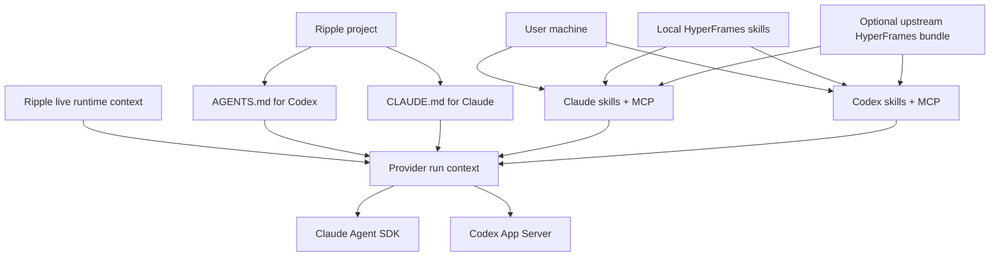
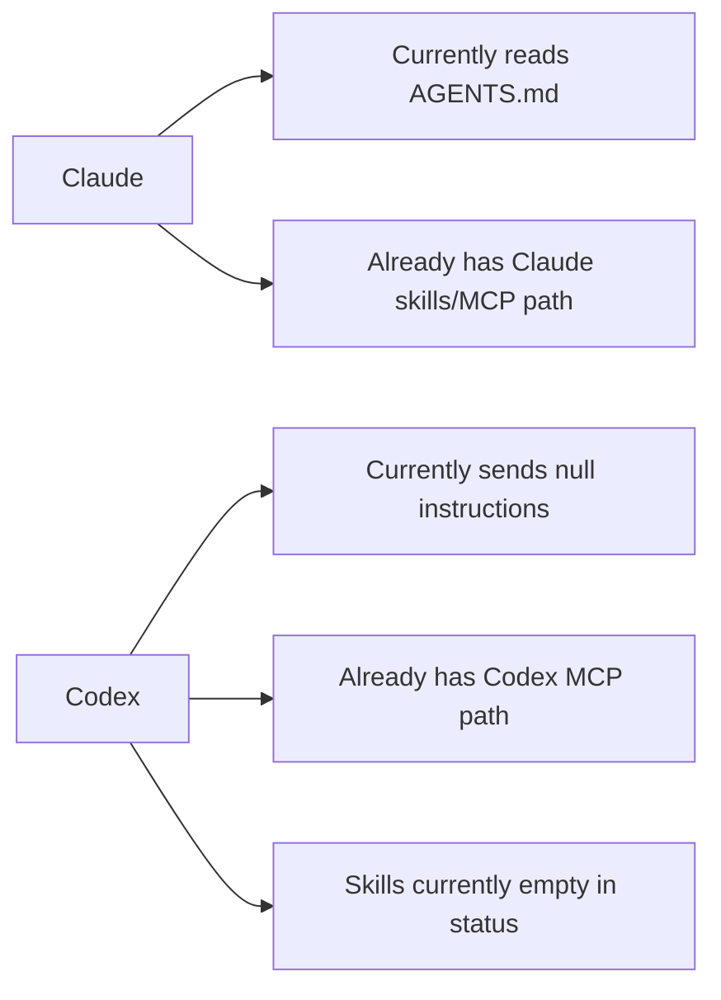

# Phase 13: Agent Instructions, Skills, And MCP Setup

This ExecPlan must be maintained according to `PLANS.md`.

## Purpose / Big Picture

After this phase, every Ripple project is ready for both supported agent
providers without asking the user to understand prompt engineering, skill
installation, MCP setup, or HyperFrames authoring rules.

When a user creates a new Ripple project, the project gets both native agent
instruction files: `AGENTS.md` for Codex and `CLAUDE.md` for Claude. These files
contain the durable project instructions that explain Ripple's motion-editor
model, HyperFrames HTML/CSS/GSAP authoring rules, project boundaries, and
product language. Existing projects get a safe check/backfill path so older
projects can be brought up to the same baseline.

Ripple also makes the user's existing agent environment available instead of
replacing it. Claude runs should see Claude project/user skills and MCP servers.
Codex runs should see Codex MCP servers and, once wired, installed Codex skills.
The local HyperFrames skills that ship with the installed package are
registered into the native locations those agents already understand, and the
broader upstream HyperFrames bundle can be offered as an explicit setup action.
Ripple does not create a new app-owned skill system in this phase; app-specific
guidance lives in `AGENTS.md`, `CLAUDE.md`, and per-run runtime context.

The visible result is that a designer can ask Claude or Codex to create or edit
a title card, lower third, transition, social overlay, or frame-comment
revision, and the agent begins with the right project instructions, the right
HyperFrames skills, the user's existing MCP/tool context, and live Ripple state
such as the selected composition, frame, comment anchor, revision workspace, and
export target.

## Progress

- [x] 2026-05-02 / User + Codex: Agreed to use native provider instruction
  files rather than creating a Ripple-owned skill bundle. `AGENTS.md` is the
  Codex-facing file; `CLAUDE.md` is the Claude-facing file.
- [x] 2026-05-02 / User + Codex: Agreed that Ripple should enable existing user
  skills/MCP and install or register HyperFrames skills so users' agents can
  access them while working in Ripple.
- [x] 2026-05-02 / Codex: Read `PLANS.md`, the Phase 13 roadmap section, Phase
  9 provider-integration plan, Phase 12 template plan, current project scaffold,
  Claude capability loading, Codex MCP loading, skill router, and provider
  prompt paths before drafting this plan.
- [x] 2026-05-02 / Codex + sub-agents: Audited the draft against local Ripple
  architecture, the local bundled Codex App Server schema, the local Claude
  Agent SDK package, the installed HyperFrames package, and official Codex,
  Claude, and HyperFrames docs.
- [ ] Milestone 0: Inventory current provider instruction, skills, and MCP
  behavior with tests or small probes.
- [ ] Milestone 1: Add shared project instruction templates for `AGENTS.md` and
  `CLAUDE.md`.
- [ ] Milestone 2: Scaffold and backfill instruction files for new and existing
  Ripple projects.
- [ ] Milestone 3: Make Claude load `CLAUDE.md` and keep Claude skills/MCP
  available during agent-runtime sessions.
- [ ] Milestone 4: Make Codex load `AGENTS.md` and wire the missing Codex skill
  visibility path without regressing Codex MCP.
- [ ] Milestone 5: Add HyperFrames skill install/register flow.
- [ ] Milestone 6: Add shared runtime context packaging for project,
  composition, comment, revision, preview, and export state.
- [ ] Milestone 7: Validate both providers end to end.

## Surprises & Discoveries

- Observation: Claude currently loads `AGENTS.md`, not `CLAUDE.md`, in the
  main agent-runtime path.
  Evidence: `src/main/lib/agent-runtime/providers/claude-runtime-capabilities.ts`
  reads `path.join(cwd, "AGENTS.md")` and appends it to the Claude Code preset
  system prompt.

- Observation: Codex currently resolves and reports MCP context, but its App
  Server `thread/start` call sends `baseInstructions: null` and
  `developerInstructions: null`.
  Evidence: `src/main/lib/agent-runtime/providers/codex-app-server-adapter.ts`
  calls `resolveCodexMcpSnapshot(...)`, emits MCP capability status, then starts
  the thread with null instruction fields.

- Observation: Skill mentions in the runtime prompt do not load skill files.
  They only become plain instruction text.
  Evidence: `src/main/lib/agent-runtime/prompt-mentions.ts` converts
  `@[skill:name]` to `Use the "name" skill(s) for this task.`

- Observation: Ripple's settings/mention skills surface currently scans Claude
  and plugin skill locations, not Codex skill locations.
  Evidence: `src/main/lib/trpc/routers/skills.ts` lists project
  `.claude/skills`, user `~/.claude/skills`, and enabled plugin skills.

- Observation: The official HyperFrames CLI exposes a skills installer for AI
  coding tools, but `hyperframes skills` is an installer, not a discovery
  command, and it fetches from the network.
  Evidence: `node_modules/.bin/hyperframes --help` includes `skills`, and the
  local CLI implementation shells out to `npx skills add heygen-com/hyperframes
  --all`.

- Observation: The locally installed HyperFrames package includes the minimum
  official skills Ripple needs, but not the full remote skill bundle.
  Evidence: `node_modules/hyperframes/dist/skills/` contains `hyperframes`,
  `hyperframes-cli`, and `gsap` skill directories with `SKILL.md` files and
  supporting references/scripts.

- Observation: Local HyperFrames guidance has one rule conflict that Phase 13
  must resolve before copying instructions into `AGENTS.md` or `CLAUDE.md`.
  Evidence: `node_modules/hyperframes/dist/skills/hyperframes/SKILL.md` implies
  composition duration can come from `data-duration`, while
  `node_modules/@hyperframes/core/docs/core.md` says composition clip duration
  comes from the registered GSAP timeline and does not require
  `data-duration` on the composition clip.

- Observation: The Codex App Server schema in the bundled `codex-cli 0.125.0`
  has the native surfaces Phase 13 needs.
  Evidence: `codex app-server generate-ts` produced `ThreadStartParams` with
  `baseInstructions` and `developerInstructions`, `UserInput` with
  `{ type: "skill", name, path }`, and client requests for `skills/list` and
  `skills/config/write`.

- Observation: Official Codex skill docs and the HyperFrames CLI docs disagree
  about the Codex user skill directory name.
  Evidence: Codex docs describe repo `.agents/skills` and user
  `$HOME/.agents/skills`, while HyperFrames CLI docs say `hyperframes skills
  --codex` installs to `~/.codex/skills/`. Phase 13 must use App Server
  `skills/list` and local probes as source of truth instead of hardcoding one
  assumption.

- Observation: Provider runs need both the isolated execution workspace and the
  canonical Ripple project root.
  Evidence: `AgentRuntimeService` resolves workspace context that includes the
  real project path, but provider adapters currently receive only
  `context.workspace.path` as `cwd`. Generated-change runs execute in isolated
  revision worktrees, so project-scoped instruction files, skills, and MCP can
  disappear unless the project root is carried through.

- Observation: Runtime live context needs an API shape before it can be
  reliably injected.
  Evidence: `AgentRuntimeChatTransport` and the `agentRuntime.chat` tRPC schema
  currently send prompt, provider, model, target conversation, attachments, and
  auth only. Selected composition, frame/time, preview source, revision view,
  and export source are owned by the Ripple shell and are not part of the
  runtime request payload yet.

## Decision Log

- Decision: Use provider-native instruction files as the durable app-specific
  prompt surface.
  Rationale: The user wants Claude and Codex to use their respective native
  conventions. `CLAUDE.md` should serve Claude, and `AGENTS.md` should serve
  Codex. This avoids a bespoke Ripple prompt bundle while keeping project
  behavior inspectable and editable by users.
  Date/Author: 2026-05-02 / User + Codex.

- Decision: Do not build a Ripple-owned skill bundle in Phase 13.
  Rationale: The existing HyperFrames skills plus provider-native user skills
  are enough for this phase. Ripple-specific guidance belongs in instruction
  files and runtime context until real gaps are proven.
  Date/Author: 2026-05-02 / User + Codex.

- Decision: Preserve and enable user-installed skills and MCP rather than
  replacing them.
  Rationale: Ripple should work with the user's existing Claude/Codex setup and
  expose useful tools in agent sessions. Installing HyperFrames skills should
  add motion-authoring capability, not erase personal or team configuration.
  Date/Author: 2026-05-02 / User + Codex.

- Decision: Keep live Ripple state out of static instruction files.
  Rationale: Selected composition, frame/time, comment anchor, revision
  workspace, preview target, and export destination change per run. These are
  runtime context, not durable project policy.
  Date/Author: 2026-05-02 / User + Codex.

- Decision: Prefer native Claude `CLAUDE.md` loading over manual system-prompt
  append.
  Rationale: The Claude Agent SDK loads project `CLAUDE.md` when
  `settingSources` includes `project`. Manually reading and appending the same
  file risks duplicate instructions and bypasses native discovery behavior.
  Date/Author: 2026-05-02 / Codex + sub-agents.

- Decision: Prefer deterministic local HyperFrames skill registration first,
  with the upstream installer as an explicit setup action.
  Rationale: The installed package contains `hyperframes`, `hyperframes-cli`,
  and `gsap` skills locally. The broader upstream installer can write broad
  per-agent configuration and requires network access, so Ripple should not run
  it silently.
  Date/Author: 2026-05-02 / Codex + sub-agents.

## Outcomes & Retrospective

Not started.

## Context and Orientation

Ripple is a local-first desktop app for creating short HyperFrames motion
graphics with chat, frame-anchored comments, reviewable revisions, preview, and
export. The codebase is still partially inherited from 1Code, so Phase 13 is a
boundary-setting phase: it teaches the existing agent runtime to start from
motion-design instructions instead of generic coding-app assumptions.

Provider execution now flows through the main process. The renderer sends chat
and comment requests through `src/renderer/features/agents/lib/agent-runtime-chat-transport.ts`
to `src/main/lib/agent-runtime/service.ts`. The service resolves the workspace,
creates an agent run, chooses a provider adapter, persists run events, and
projects transcripts back to the UI.

Codex uses the App Server adapter in
`src/main/lib/agent-runtime/providers/codex-app-server-adapter.ts`. It already
resolves Codex MCP configuration through `resolveCodexMcpSnapshot(...)` from
`src/main/lib/trpc/routers/codex.ts`. It starts Codex App Server threads and
turns with a workspace-write sandbox and network disabled, but it does not yet
send `AGENTS.md` content as `baseInstructions` or `developerInstructions`, and
it reports `sessionInit.skills: []`. The local App Server schema supports
`skills/list`, `skills/config/write`, and `UserInput` items of type `skill`, so
Phase 13 should use those native surfaces where they work.

Claude uses the Agent SDK adapter in
`src/main/lib/agent-runtime/providers/claude-agent-sdk-adapter.ts`. Capability
loading lives in
`src/main/lib/agent-runtime/providers/claude-runtime-capabilities.ts`. It
already merges Claude MCP servers, enabled plugin MCP, enabled plugin skills,
project `.claude/skills`, and user `~/.claude/skills`. It currently reads
`AGENTS.md` and appends it to the Claude Code preset system prompt. This phase
changes that provider contract so Claude uses native `CLAUDE.md` loading
through SDK `settingSources` and reads the file only for status/reporting when
needed.

There is also a legacy Claude tRPC route in `src/main/lib/trpc/routers/claude.ts`
that still reads `AGENTS.md` and appends it to a system prompt. Phase 13 must
either update this path to the same `CLAUDE.md` contract or prove with tests
that no Ripple chat/comment/edit surface still uses it.

Project creation goes through
`src/main/lib/ripple-projects/scaffold.ts`, which calls
`installRippleProjectTemplate(...)` in
`src/main/lib/hyperframes/templates/installer.ts`. Phase 13 adds instruction
file scaffolding to this path without weakening destination safety checks.

The existing skills settings surface is implemented in
`src/main/lib/trpc/routers/skills.ts` and renderer settings/mention components.
It currently treats skills as Claude-style `SKILL.md` directories plus plugin
skills. Codex skill visibility needs a separate bridge because Codex uses its
own native configuration and the App Server path can report skills, but Ripple
does not yet populate them.

HyperFrames is the motion runtime. Phase 12 already bundled the template
catalog under `resources/hyperframes-templates/`. Phase 13 does not add new
templates. It installs or registers HyperFrames agent skills so Claude and
Codex know how to author valid HyperFrames HTML compositions, data attributes,
clip timing, local assets, and paused GSAP timelines. The deterministic first
target is the local package skills `hyperframes`, `hyperframes-cli`, and
`gsap`; the broader network-fetched upstream bundle is an explicit setup
option, not automatic hidden work.

## Plan of Work

Milestone 0 records the actual provider behavior in tests before changing it.
Add or update tests near the existing provider adapters and prompt helpers so a
future agent can see the current regression surface: Claude currently loads
`AGENTS.md`; Codex currently starts with null instruction fields; skill mentions
are prompt text only; Claude skills/MCP and Codex MCP are already discovered by
different paths. Generate the bundled Codex App Server TypeScript schema into a
temporary directory and record the relevant instruction/skill methods in this
plan so implementation follows the local `codex-cli 0.125.0` contract.

Milestone 1 creates shared instruction templates. Add a small main-process
module such as `src/main/lib/ripple-projects/agent-instructions.ts` that can
render `AGENTS.md` and `CLAUDE.md` from one source of truth with provider-
specific headings. The files should use Ripple product language: project,
composition, asset, timeline, frame, comment, revision, preview, export,
accept, and reject. They should tell agents to edit plain HyperFrames HTML/CSS/
GSAP, preserve `data-composition-id`, `data-width`, `data-height`, clip
attributes, local assets, and registered paused `window.__timelines`, and avoid
repo-first, branch-first, React-scene, Remotion-primary, setup-gate, or
network-fetch assumptions.

Milestone 2 wires scaffolding and backfill. New projects should write both
files during `writeRippleProjectScaffold(...)` or the template installer. The
safe-destination allowlist in `scaffold.ts` should include `AGENTS.md` and
`CLAUDE.md`. Add a project-check/backfill helper that can create missing files
for existing Ripple projects without overwriting user edits. The helper should
be callable from an environment/readiness route or project-open path, and it
should report whether files were present, created, or user-modified. For
managed Ripple projects, creating missing instruction files after the managed
Git baseline exists must refresh the managed baseline so future revision
worktrees contain the files. For unmanaged projects, do not silently commit or
rewrite history; report the backfill result and leave version-control decisions
to the user.

Milestone 3 changes Claude to use native `CLAUDE.md` behavior. Keep
`settingSources` including `project` and `user` so the SDK loads project and
user memories. Stop manually appending `AGENTS.md` in the main agent-runtime
path. Read `CLAUDE.md` only to show capability/status such as `claudeMdLoaded`
and to validate that it exists, and add a regression proving the file is not
duplicated in the final prompt. Keep Claude MCP, plugin, project skill, and user
skill behavior intact. Audit the legacy `src/main/lib/trpc/routers/claude.ts`
path and either update it to the same `CLAUDE.md` contract or prove it is no
longer reachable from Ripple.

Milestone 4 changes Codex to use `AGENTS.md` and completes Codex skill
visibility. Carry the full resolved workspace context into provider adapters:
the isolated execution `cwd`, the canonical project root, and the revision or
conversation identity when present. Pass Codex project instructions through
`thread/start` `baseInstructions` or `developerInstructions` according to the
verified local App Server schema, while keeping per-run Ripple live context on
the turn. Keep workspace-write sandboxing, writable roots, and network-off
defaults. Use App Server `skills/list` to discover enabled skills for the
canonical project root and execution workspace, including `perCwdExtraUserRoots`
if Ripple registers app-provided skills. When the user explicitly mentions a
skill and a matching enabled skill path is known, send a typed
`{ type: "skill", name, path }` input item instead of only plain text. If native
skill input fails in the bundled version, fall back with an explicit status and
test-covered prompt text. Codex MCP behavior should continue to come from
`resolveCodexMcpSnapshot(...)` until Ripple moves to native App Server MCP RPCs.

Milestone 5 installs or registers HyperFrames skills. The deterministic default
is to copy or symlink the local package skills from
`node_modules/hyperframes/dist/skills/{hyperframes,hyperframes-cli,gsap}` into
provider-native skill roots or expose them as extra roots where the provider
supports that. The install flow should be idempotent, visible in
settings/readiness, and safe for existing user configuration. Do not silently
run `hyperframes skills` because it shells out to a network installer and can
write broad per-agent configuration. If the UI offers the upstream
network-fetched bundle, make it an explicit setup action and report exactly
which provider locations were touched. If Ripple ever invokes `hyperframes
init`, pass `--skip-skills` so project creation does not surprise-install
skills.

Milestone 6 standardizes runtime context packaging. Add a typed
`runtimeContext` payload to the renderer transport and `agentRuntime.chat` tRPC
schema for normal chat. Populate it from the Ripple shell with selected
composition, preview time/frame, visible preview source, active comment/revision
view, and export source when present. Validate and enrich the payload in the
main process using project-boundary checks and current database/project state.
Route generated comment revisions through the same provider-neutral context
builder, preserving the existing detailed comment prompt. Do not put this
mutable state into `AGENTS.md` or `CLAUDE.md`.

Milestone 7 validates both providers. Add focused automated tests for scaffold,
backfill idempotence, managed-baseline propagation, instruction loading,
skill/MCP capability summaries, provider-native skill invocation, and
prompt/context construction. Include main-project, conversation-workspace, and
generated-change revision-worktree coverage so project instructions, skills,
and MCP are available in each execution context. Then run the focused Ripple
suite, TypeScript check, packaging/resource smoke for bundled HyperFrames
skills, and a desktop smoke where Claude and Codex each receive their native
instruction file and can answer using HyperFrames concepts in a project or
revision workspace.

## Concrete Steps

Run commands from `/Users/conmeara/code/ripple` unless noted otherwise.

1. Read the current files:
   - `PLANS.md`
   - `ROADMAP.md`
   - `src/main/lib/ripple-projects/scaffold.ts`
   - `src/main/lib/hyperframes/templates/installer.ts`
   - `src/main/lib/agent-runtime/service.ts`
   - `src/main/lib/agent-runtime/providers/claude-runtime-capabilities.ts`
   - `src/main/lib/agent-runtime/providers/claude-agent-sdk-adapter.ts`
   - `src/main/lib/agent-runtime/providers/codex-app-server-adapter.ts`
   - `src/main/lib/trpc/routers/skills.ts`
   - `src/main/lib/trpc/routers/codex.ts`
2. Add tests that describe the current instruction-file and skill/MCP behavior.
3. Add shared instruction template rendering for `AGENTS.md` and `CLAUDE.md`.
4. Update new-project scaffold and safe-destination checks.
5. Add existing-project backfill/check behavior without overwriting user edits.
6. Preserve/refresh managed Ripple baselines when backfill writes new managed
   project files.
7. Update Claude capability loading to rely on native `CLAUDE.md` discovery and
   remove manual `AGENTS.md` append from reachable Claude paths.
8. Update Codex App Server startup to load `AGENTS.md` through the verified
   instruction fields.
9. Wire Codex skill discovery and explicit skill invocation through
   `skills/list` and typed `skill` input items where supported.
10. Add deterministic local HyperFrames skill install/register flow and
    readiness/status reporting.
11. Add runtime context payload, main-process validator/enricher, and shared
    context builder.
12. Use the shared context builder from normal chat and comment revision paths.
13. Run validation commands and update this ExecPlan with evidence.

## Validation and Acceptance

Automated validation:

- `bun test src/main/lib/ripple-projects`
- `bun test src/main/lib/agent-runtime`
- `bun run test:ripple`
- `bun run ts:check`
- `bun run build`
- `bun run package`

Provider smoke validation:

- Create a new Ripple project and verify `AGENTS.md` and `CLAUDE.md` exist.
- Open an older Ripple project and verify missing files can be created without
  overwriting edited files.
- Create a comment revision after backfill and verify the isolated revision
  workspace can see the expected instruction files or receives their content
  from the canonical project root without editing Main.
- Start a Claude agent run and observe capability/status data showing
  native `CLAUDE.md` loading, Claude skills, and MCP as applicable, with no
  duplicate manual `CLAUDE.md` append.
- Start a Codex agent run and observe capability/status data showing
  `AGENTS.md`, Codex MCP, and Codex skills when supported.
- Ask both providers for a small HyperFrames edit. The resulting response or
  diff should refer to plain HTML compositions, data attributes, assets,
  timelines, GSAP, preview, or export in Ripple language.
- Submit a frame-anchored comment and verify the generated-change prompt still
  includes comment context and uses the isolated revision workspace.

Acceptance criteria:

- New Ripple projects scaffold both `AGENTS.md` and `CLAUDE.md`.
- Existing Ripple projects have a safe missing-file backfill path.
- Managed Ripple baselines and newly created revision worktrees include or can
  access the instruction files after backfill.
- Claude uses native `CLAUDE.md` loading for Claude sessions and keeps existing
  Claude skills/MCP available.
- Codex uses `AGENTS.md` for Codex sessions and keeps existing Codex MCP
  available.
- Codex skill discovery uses App Server `skills/list`; explicit skill mentions
  use typed skill input items when possible and a clear fallback otherwise.
- The local HyperFrames `hyperframes`, `hyperframes-cli`, and `gsap` skills can
  be installed or registered idempotently for the supported providers.
- Live Ripple context is included per run and is not stored in static
  instruction files.
- Primary user-facing language stays motion-editor oriented and avoids repo,
  branch, worktree, dependency-install, and developer-terminal language outside
  advanced/debug surfaces.

## Idempotence and Recovery

Instruction scaffolding must be repeatable. If `AGENTS.md` or `CLAUDE.md`
already exists and differs from the current template, do not overwrite it
silently. Record a status such as `present`, `created`, `missing`, or
`user-modified` so the UI can explain what happened and offer a deliberate
refresh later.

HyperFrames skill installation must be repeatable. Detect already-installed
skills before writing. Prefer app-controlled copies or symlinks from the local
HyperFrames package over network installers. If the upstream installer is
explicitly requested and creates broad per-agent configuration, cleanly separate
probe, install, and rollback notes. Do not delete user skill directories or MCP
config during cleanup. If installation partially succeeds, report exactly which
provider locations were updated and which remain missing.

Provider instruction loading should fail soft. If a project lacks `AGENTS.md`
or `CLAUDE.md`, the agent run should still start with runtime context and a
status warning, unless the user explicitly asked for a setup repair. Missing
files should not cause fallback edits outside the project or revision
workspace.

Runtime context must be derived from validated main-process state. Do not trust
renderer-provided absolute paths for project, asset, revision, or export
operations. Continue using the existing workspace-context and project-boundary
checks.

Provider runs must distinguish canonical project root from execution workspace.
The execution `cwd` may be an isolated revision worktree, while project
instructions, project-scoped skills, managed baseline state, and project MCP may
need to be resolved from the original Ripple project root. If this resolution
fails, do not silently fall back to editing Main.

## Interfaces and Dependencies

- `src/main/lib/ripple-projects/scaffold.ts`: new-project scaffold boundary and
  destination safety allowlist.
- `src/main/lib/hyperframes/templates/installer.ts`: existing template install
  path where project files are written.
- `src/main/lib/ripple-projects/agent-instructions.ts`: proposed module for
  rendering and checking `AGENTS.md` and `CLAUDE.md`.
- `src/main/lib/agent-runtime/service.ts`: shared provider execution boundary.
- `src/main/lib/agent-runtime/workspace-context.ts`: validates main,
  conversation, and revision workspace paths.
- `src/main/lib/revisions/comment-prompt.ts`: existing comment-specific prompt
  context to preserve or route through the shared runtime context builder.
- `src/main/lib/agent-runtime/providers/claude-runtime-capabilities.ts`: Claude
  instruction, skills, plugin, and MCP loading.
- `src/main/lib/agent-runtime/providers/claude-agent-sdk-adapter.ts`: Claude SDK
  query options.
- `src/main/lib/agent-runtime/providers/codex-app-server-adapter.ts`: Codex App
  Server instruction, MCP, sandbox, and capability status behavior.
- `src/main/lib/trpc/routers/skills.ts`: settings and mentions skill inventory.
- `src/main/lib/trpc/routers/codex.ts`: Codex MCP discovery and settings.
- `resources/bin/darwin-arm64/codex app-server generate-ts`: local schema
  evidence for instruction fields, skills RPCs, and typed skill input items.
- `node_modules/hyperframes/dist/skills`: deterministic local HyperFrames skill
  source for `hyperframes`, `hyperframes-cli`, and `gsap`.
- `node_modules/.bin/hyperframes skills`: upstream HyperFrames network
  installer entry point, only for explicit setup actions.
- User-level directories: `~/.claude/skills`, project `.claude/skills`, Codex
  `.agents/skills` / user `.agents/skills` locations reported by App Server
  `skills/list`, and any extra roots Ripple deliberately registers.

## Artifacts and Notes

Visual target for Phase 13:

Current provider gap before implementation:

External docs checked for this audit:

- Codex App Server: `https://developers.openai.com/codex/app-server`
- Codex `AGENTS.md`: `https://developers.openai.com/codex/guides/agents-md`
- Codex Skills: `https://developers.openai.com/codex/skills`
- Codex MCP: `https://developers.openai.com/codex/mcp`
- Claude Agent SDK system prompts: `https://code.claude.com/docs/en/agent-sdk/modifying-system-prompts`
- Claude Code skills: `https://code.claude.com/docs/en/skills`
- HyperFrames CLI: `https://hyperframes.heygen.com/packages/cli`

Record future command output, smoke evidence, and any provider-version limits
here as milestones are implemented.
